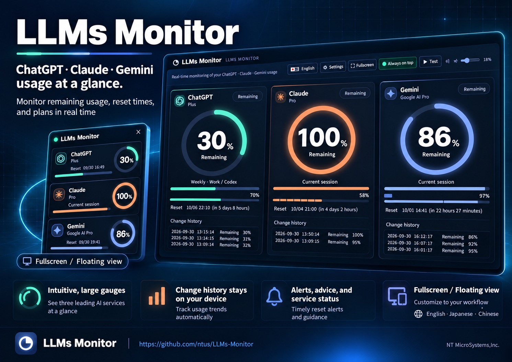
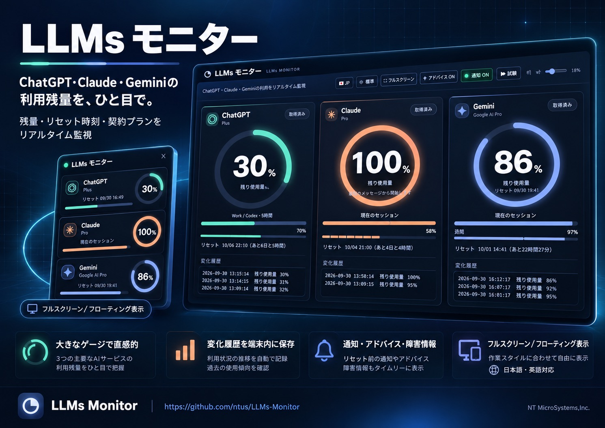

# LLMs Monitor

[Open the full-size English flyer](assets/promotional/llms-monitor-a4-landscape-flyer-en-v1.jpg?raw=1) · [Download English JPEG](assets/promotional/llms-monitor-a4-landscape-flyer-en-v1.jpg?raw=1)

**See the remaining usage across ChatGPT, Claude, and Gemini at a glance.**

[🌍 EN](#en) · [🇯🇵 JP](#ja)

This browser companion checks usage from your signed-in provider sessions about once a minute. Large gauges and bars show current and weekly limits, reset times, plans, and available credits. Your change history stays in your browser, with up to 10,000 entries per limit. The interface supports English and Japanese, light and dark themes, fullscreen viewing, and compact floating panels.

Version **1.12.0 beta** stops ChatGPT API and DOM usage values from alternately overwriting one another. The API now remains authoritative for percentages while the DOM supplements reset-expiry metadata.

[Product site](https://llmsmonitor.ntusnog.chatgpt.site/product.html) · [Open the monitor](https://llmsmonitor.ntusnog.chatgpt.site/) · [Download the beta extension package](dist/LLMs-Monitor-v1.12.0.zip) · [Detailed specification](SPECIFICATION.md) · [Privacy](PRIVACY.md) · [Follow @ntus on X](https://x.com/ntus)

## Basic specifications

- **Platforms:** static web monitor plus a Manifest V3 extension for desktop Chrome and Edge. The extension supplies data from currently signed-in official provider accounts.
- **Services:** ChatGPT, Claude, and Gemini, individually shown or hidden and reordered. Available session and weekly limits, plans, credits, reset times, and local change history are displayed only when provider data is available.
- **Refresh:** usage about every minute; official OpenAI, Claude, and Gemini status feeds every minute. Active incidents trigger a visible alert and optional sound. The ⓘ control also shows a normal or unavailable state.
- **Storage:** settings and up to 10,000 history entries per limit stay in browser local storage; provider passwords are never requested.
- **Display:** English/Japanese, light/dark, fullscreen, floating window, supported browser Picture-in-Picture, configurable translucency, and alert volume.
- **Limits:** provider APIs and pages may change; unverified values remain unavailable. The floating window cannot provide OS-wide transparency or always-on-top behavior without browser support.

[Revision history](CHANGELOG.md#en) · [Security review](SECURITY_REVIEW.md#en)

## Quick start

1. Sign in to the services you want to monitor on their official [ChatGPT](https://chatgpt.com/), [Claude](https://claude.ai/), and [Gemini](https://gemini.google.com/) sites in the same Chrome or Edge profile. Enter credentials only on those sites.
2. Before store approval, run `python3 build.py --package`, unpack `dist/LLMs-Monitor-v1.12.0.zip`, and load the unpacked extension from the browser's extension management page for beta testing. Installing without developer mode requires Chrome Web Store or Edge Add-ons review and publication.
3. Open the extension or the [web monitor](https://llmsmonitor.ntusnog.chatgpt.site/). The web monitor asks for your extension ID once. The providers' usage tabs do not need to remain open.
4. Use **Show and arrange services** to choose and reorder cards. Hidden services continue collecting history. Adjust language, theme, opacity, volume, and fullscreen mode from the controls.

The monitor never asks for provider passwords and never exercises a reset entitlement automatically. A reset link opens the official usage page when an entitlement is available. If a provider does not expose a reliable plan or deadline, the app shows it as unavailable rather than guessing. Document Picture-in-Picture can keep a panel on top in supported browsers; OS-wide window transparency and native mobile apps are outside this beta.

For contributors and future AI-assisted changes, read [AGENTS.md](AGENTS.md), the [specification](SPECIFICATION.md), and the [requirements ledger](spec/requirements.json) before editing. Run `node --test tests/*.test.cjs` and `python3 build.py --package` before a package release.

---

# 日本語 — LLMs モニター

**ChatGPT/Claude/Geminiのトークン利用残量をリアルタイム表示**

[日本語版チラシを原寸表示](assets/promotional/llms-monitor-a4-landscape-flyer-v1.jpg?raw=1) · [日本語版JPEGをダウンロード](assets/promotional/llms-monitor-a4-landscape-flyer-v1.jpg?raw=1)

[🌍 EN](#en) · [🇯🇵 JP](#ja)

## 1.12.0 β

ChatGPTのAPI残量とDOM残量が交互に上書きされ、52%と69%などを往復する問題を修正しました。残量はAPIを正本とし、DOMからはリセット権の種別・有効期限など補足情報だけを統合します。

前版で追加したTibo氏、各社公式X、BridgeMind／NerfBenchの1分周期速報も維持します。X認証情報は拡張機能へ入れず、サーバー側Secretだけで扱います。実データ接続にはX Developer bearer token、サーバーキャッシュ、1分cronの設定が必要です。

## 1.9.0 β

Claudeの週間枠とクラウドセッションクレジットへ現在セッション単位の区切りを追加し、クラウドセッションクレジット残額を小数点以下2桁に丸めました。残量変化時は通知音を開始してから赤色点滅を表示します。公式障害情報は引き続き1分ごとに確認します。

## 1.6.4 β

ChatGPT、Claude、Gemini の残量とリセット時刻を、ログイン中の公式セッションから約1分ごとに確認するブラウザー用モニターです。円とバーで現在枠・週間枠を見渡し、変化履歴を各枠最大10,000件まで端末内に保持します。日本語／英語、標準／ダーク、フルスクリーン、通常小窓、対応ブラウザーでの最前面表示に対応します。

v1.6.4では履歴読込結果と通知音説明を左右ボタン付きのステータスログへ集約し、履歴読込メッセージの再計算を最大1分に1回へ抑えました。通常小窓は明示的なボタン操作時だけ開き、作成時の固定幅・固定高を廃止してブラウザーとOSが許す範囲で自由にリサイズできます。

3サービスの表示・非表示と順序を保存し、表示枚数に合わせてレイアウトを調整します。履歴から週間枠が現在セッションの何枠分に相当するかを推定し、期限が近いリセット権と利用枠を段階的に警告します。分析欄は高さを約半分に抑え、利用ペースの提案、公式ソース付きTips／NEWSを切り替えて表示します。通知音量のスライダー操作中も画面が動かないよう修正し、アプリアイコンを刷新しました。

[使い方](#使い方) · [基本仕様](#基本仕様) · [改訂履歴](CHANGELOG.md#ja) · [詳しい仕様と制限](SPECIFICATION.md) · [デグレ防止手順](AGENTS.md) · [プライバシー](PRIVACY.md) · [更新情報をXで見る](https://x.com/ntus)

## 基本仕様

- **構成:** OSに依存しない静的Webモニターと、デスクトップ版Chrome／Edge用Manifest V3拡張機能。ログイン済みの公式セッションから拡張機能がデータを取得します。
- **対象:** ChatGPT、Claude、Gemini。表示・非表示と順序を設定でき、提供元から確認できた現在枠、週間枠、契約プラン、クレジット、リセット時刻、変化履歴を表示します。
- **更新:** 残量は約1分ごと、各社の公式障害情報は約1分ごと。障害があれば画面内警告と設定に応じた通知音で知らせ、ⓘから正常時も確認できます。
- **保存:** 設定と各枠最大10,000件の履歴はブラウザー内に保存。パスワード入力は求めません。
- **画面:** 日英、標準／ダーク、フルスクリーン、通常小窓、対応ブラウザーの最前面表示、半透明度と音量調整。
- **制約:** 提供元の画面やAPI変更により未取得になる場合があります。OS全体での窓透過・常時最前面はブラウザーの対応範囲に限られます。

### 使い方

1. 同じChromeまたはEdgeプロファイルで [ChatGPT](https://chatgpt.com/)、[Claude](https://claude.ai/)、[Gemini](https://gemini.google.com/) に必要な分だけログインします。パスワードは公式サイトで入力します。
2. ストア公開前は、このリポジトリで `python3 build.py --package` を実行し、`dist/LLMs-Monitor-v1.12.0.zip` を展開して、ブラウザーの拡張機能管理画面から開発用として読み込みます。一般ユーザーがデベロッパーモードなしで導入するには、Chrome Web Store / Edge Add-ons の審査・公開が必要です。
3. 拡張機能の画面、または [公開モニター](https://llmsmonitor.ntusnog.chatgpt.site/) を開きます。公開モニターでは拡張機能IDを一度登録してください。各サービスの使用量タブを開いたままにする必要はありません。
4. 「表示サービス」からチェックと上下ボタンで表示数・順序を変更します。非表示中も取得と履歴保存は続きます。音、テーマ、言語、透明度、フルスクリーンも画面上で変更できます。
5. 残量とリセット時刻は公式サービスが返す範囲で表示されます。リセット権は利用可能なら公式利用量ページへ移動できますが、アプリから自動行使しません。出典のあるTips／NEWSはリンクで原文を確認できます。

### β版の注意点

Geminiなどの契約プランは公式アカウント画面から取得できない場合があります。その場合は未取得と表示し、推測した有料プラン名は付けません。週間の「現在セッション何枠分」は十分な同期履歴があるときだけ推定表示します。ブラウザー外のOS全体での常時最前面・窓全体の透過はWeb拡張機能の機能ではありません。対応ブラウザーのDocument Picture-in-Pictureを使用します。iOS／Androidのネイティブ版は今後の設計対象で、今回のβには含みません。

OSに依存しない静的Webアプリと、Chrome / Edgeデスクトップ用Manifest V3拡張機能です。Safari、Firefox、モバイルブラウザへの対応は未検証です。

## 使い方

1. Chrome Web StoreまたはMicrosoft Edge Add-onsで審査公開された拡張機能を追加します。ストア公開前のZIPは審査提出・動作確認用です。
2. ChatGPT・Claude・Geminiの公式サイトへ普段のブラウザプロファイルでログインします。モニタにパスワードを入力する画面はありません。
3. ツールバーの「LLMs モニター」を開きます。以後は60秒ごとにバックグラウンド取得し、専用タブを開いたままにする必要はありません。
4. 各AIサイト上の半透明パネル、必要時にボタンで開くフローティング小窓、またはメインモニタで残量を確認します。
5. 常に手前へ置く場合はメイン画面の「最前面に固定」を押します。ブラウザの制約によりユーザー操作が必要で、元のモニター画面を閉じると終了します。

ホストされたWebアプリは、拡張機能の詳細画面にある32文字のIDを入力すると接続できます。拡張機能に内蔵したモニターはID入力不要・ネット接続なしでも起動できます。取得には各サービスへの通信が必要です。

## 表示と制約

- Claude: 現在のセッション・週間の使用済み率から残量を算出。製品別内訳や追加クレジットは混ぜません。
- Gemini: 公式使用量ページの現在・週間の使用率から残量を算出。
- ChatGPT: 現時点で確認した公式使用量ページは通常Chatを含みません。表示できるのは **Work / Codex等の共通利用枠** です。「通常のChat：取得不可」と明記します。Chatの正確な残量は未実装・取得未確認です。
- 数値がない場合は「—」。更新中・取得失敗時は前回取得値を保持し、ログアウト時は数値を消去。125秒以上経過すると「更新待ち」を表示します。
- 常駐パネルは対象3サイトのページ内で半透明表示されます。背景不透明度は15〜100%です。通常小窓およびPiPのウィンドウ自体は、OSデスクトップを透過するネイティブオーバーレイではありません。
- 通常小窓はボタン操作時だけ開き、ブラウザーとOSが許す範囲で縦横にリサイズできます。対応Chrome/Edgeでは、ユーザーが「最前面に固定」を押すとDocument Picture-in-Pictureへ切り替えます。
- 複数アカウントの合算はしません。各公式サービスで現在選択されているアカウントが対象です。アカウント切り替え後は「今すぐ更新」を押してください。
- 公式DOM構造を読むため、サービス側の変更で修正が必要になることがあります。

## データ・権限

パスワードは読み取りません。ChatGPTの使用量取得では、公式ページが現在のログインに使っているアクセストークンを取得処理中のメモリ内だけで利用し、保存・ログ出力・第三者送信をしません。ClaudeとGeminiも現在の公式ログインセッションを使います。取得対象は契約名・利用枠・残率・リセット時刻・関連クレジットです。使用量・履歴・表示設定はブラウザのlocalストレージだけに保存し、運営サーバーへアップロードしません。送信・購入操作は自動実行しません。

拡張機能に対する3サイトの閲覧権限は、ログイン中の公式セッションで使用量を取得するために必要です。ブラウザ再起動時は前回値をすぐ表示し、その後バックグラウンド更新します。

## 開発

- `python3 -m http.server 4173 --directory dist` でローカルWeb版の表示を確認できます。本番Manifestは安全のためlocalhostからの外部接続を許可しないので、実データ接続は拡張機能内蔵画面か公開HTTPS版で検証します。
- `node --test tests/*.test.cjs` で残量パーサーを検証。
- `python3 build.py` でWeb成果物を更新し、ストア配布ZIPを意図的に更新する場合だけ `python3 build.py --package` を使う。
- `dist/` が静的Web配布物。`extension/` が読み込み可能な拡張機能。

実装契約、取得経路、データモデル、手動検証項目は [SPECIFICATION.md](SPECIFICATION.md) を正本とし、機械可読の受入条件は [`spec/requirements.json`](spec/requirements.json) を参照してください。公式サービスの非公開内部構造は変更され得るため、拡張機能の実アカウントでの通し動作はリリースごとに確認します。
