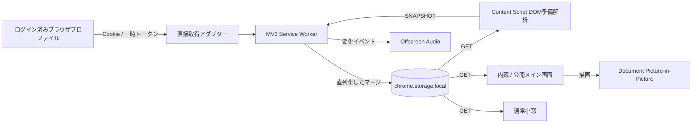

# LLMs Monitor — Implementation Specification

[🌍 EN](#en) · [🇯🇵 JP](#ja)

<a id="en"></a>

Document revision: 1.0 · Product version: **1.25.0** · Web UI: **1.25.0** · Web companion: `https://llmsmonitor.ntus.info/` (previous Site origin retained for compatibility)

This English section defines the implementation contract for the beta. The [Japanese section](#ja) contains the full historical and field-level acceptance criteria. Implementers must read both sections and every ID in [`spec/requirements.json`](spec/requirements.json); neither translation overrides the other.

## 1. Product behavior

The Chrome/Edge Manifest V3 extension reads remaining usage from the already signed-in ChatGPT, Claude, and Gemini accounts about every 60 seconds without requiring their usage tabs to remain open. It uses official service requests first and official-page DOM parsing as a fallback. It must never request a provider password or API key in its own UI. A signed-out service gets a link to the provider's official sign-in or usage page. Display only obtained provider values as official values; show unavailable when a plan, deadline, or credit cannot be obtained reliably.

Each service card shows its plan, current and weekly limits, percentage gauge, horizontal bars, reset date/time and time left, available credits or reset entitlements, and a per-limit change-history box. The floating popup, Document Picture-in-Picture view, and provider-page panel must preserve the same essential data. The normal popup opens only after an explicit button action and is freely resizable within browser and OS limits; an always-on-top Document PiP view starts only after a user gesture in a supporting browser. The web page alone cannot provide an OS-wide always-on-top window or make the native browser-window chrome transparent.

## 2. Data and persistence

The extension background worker owns `ServiceSnapshot`, `UsageWindow`, `Extra`, history, and settings state. A usage window has a 0–100 remaining percentage and optional reset timestamp. An extra may have a value, detail, expiry, and optional bar percentage. Values from API and DOM sources merge without erasing a known plan, credit, or future reset time merely because the next source omits it. An account boundary prevents one user's prior values from appearing under another user. A transient refresh failure keeps the last known display value; sign-out clears current personal values but retains stored history.

History records the first observed value after startup and subsequent **changed** values only, per usage-window label, up to 10,000 entries. It survives restarts and extension upgrades. On startup, load as much recent history as can be read and analyzed within roughly three seconds. Put its date range, count, and elapsed time in the shared status log; refresh that summary no more than once per minute and retain it for review with previous/next controls. Previously stored ChatGPT weekly-label aliases must be migrated without discarding rows. The same restored history feeds the advice engine. Provider access tokens exist only in request memory and must never enter storage, logs, displayed values, or this repository. Usage, history, and settings stay in browser extension storage and are not uploaded to the operator.

## 3. Settings, presentation, and alerts

Settings include theme (`dark`/`standard`), language (`ja`/`en`), opacity (15–100), site-panel position, sound enabled and volume, panel visibility, `serviceOrder`, and `hiddenServices`. Missing older preferences default to all three services in ChatGPT–Claude–Gemini order. Users can choose zero through three cards and reorder them; zero shows an empty state, one centers, two form two columns, and three form three columns where space permits. Hidden services continue fetching and saving history. Propagate changes to the web page, extension page, popup, PiP, and in-page panel. Detect Japanese at first launch only when the environment language is Japanese; otherwise use English. Keep the product title in the appropriate language and synchronize standard/dark appearance.

Keep previous values visible while fetching. When a numeric value changes, blink **only that numeric text** red for ten seconds. Aggregate simultaneous changes into one audible event, with at most three local notification tones one second apart. Sound defaults on; browser audio may require an initial gesture. Do not rebuild or move the volume slider while it is being dragged. The fullscreen layout must retain bars and history, increase readability, and avoid page-level scrolling at supported desktop sizes.

Use red inverse text and a warning symbol when a current-session reset is under two hours away, a weekly reset under one day away, or a ChatGPT reset entitlement expires in under five days. For any window under one hour or entitlement under one day, add a gentle two-second fade. Respect reduced-motion settings. Unknown dates must not trigger a fabricated warning. When the entitlement is available, show its official expiry and a ticket-marked link to the official usage page; never exercise it automatically.

## 4. Advice and sourced updates

The compact bottom ticker rotates approximately every nine seconds. Analyze the locally restored history to forecast consumption and provide plan-fit advice only when observations are sufficient. Advise on reset-entitlement timing, including waiting for an imminent natural reset where appropriate. A weekly bar may show an **estimated** number of full current-session equivalents: pair current and weekly changes captured at the same timestamps in the last seven days, accept paired decreases within six hours, and require at least ten current percentage points plus one weekly point consumed. Divide weekly remaining percentage by the observed cost of one full current session. Do not show a number when evidence is insufficient, and label the result as an estimate.

Tips and NEWS must include the primary-source HTTPS link, publisher, and date. Release-bundled news headlines expire after 45 days, then fall back to an official changelog. The news display must not send private usage history externally. Claude Code's graceful stopping and post-reset automatic continuation are separate features and must not be conflated.

## 5. Code, build, and release contract

`extension/` is authoritative. `background.js`, `fetchers.js`, `parser.js`, `state.js`, and `history.js` acquire and normalize data; `shared.js`, `preferences.js`, `locale.js`, `advice.js`, and CSS render the common surfaces. `build.py` copies shared assets to `dist/`, synchronizes documentation into the extension package, cache-busts public assets, and creates `dist/LLMs-Monitor-v1.19.0.zip`. Manifest, UI, ZIP, specification, and store checklist versions must agree. Chrome Web Store/Edge Add-ons review is necessary for installation without developer mode; the ZIP alone does not provide that. Future native macOS, Windows, iOS, and Android apps should reuse the normalized data contracts and analysis rules through platform-specific authentication/window adapters; those apps are not part of this release.

Run `node --test tests/*.test.cjs`, `python3 build.py --package`, ZIP-content and version checks, and UI smoke checks. Test sign-in/sign-out, refresh fallback, every display surface, language/theme/opacity, deadline boundaries, history retention, and service visibility/order on actual Chrome and Edge installations before claiming live-account acceptance. Keep the Site's existing audience unless the user explicitly changes it. See the [Japanese detailed specification](#ja) and [requirements ledger](spec/requirements.json) for every acceptance case.

## 6. Documentation language and navigation

Human-readable documentation must start in English and place Japanese in the latter part of each document. Provide visible `🌍 EN` and `🇯🇵 JP` links near the top and at the Japanese section. This applies to the README, implementation specification, agent instructions, privacy policy, store checklist, and the web privacy page. Keep the translated sections synchronized when behavior or release details change. JSON manifests and the machine-readable requirements ledger retain their schema; their prose values may remain in the language required by the existing data contract.

---

## Current release: v1.25.0 — refresh recovery and independent task acquisition

The API billing reader awaits `API_CREDIT_SNAPSHOT` before acknowledging `API_CREDIT_READ`. In v1.24.0, REFRESH awaited that acknowledgement while its global command queue also blocked the snapshot behind REFRESH: a circular wait. v1.25.0 dispatches authenticated billing snapshots outside that queue; the existing billing-specific queue, host/path/top-frame checks remain. Reader replies are bounded at 5 seconds and the optional billing refresh at 8 seconds. Audio setup/acknowledgement is bounded at 1.5 seconds each, so sound failure cannot block quota publication. The offscreen player starts its first tone before acknowledging, with the remaining two beats at 1-second intervals. A 1.1-second resume timeout and request deadline suppress late audio; public status/intelligence alert audio uses the same bounded setup/acknowledgement.

GET projects expired cached windows as unavailable (`remaining:null`, `expired:true`) and marks stalled refreshes after 45 seconds. It does not write storage, change history, create a synthetic 100%, or reuse a past deadline as “reset soon.” Shared rendering applies the same guard when connected to an older extension. Metadata-only ChatGPT DOM supplements retain the prior API quota capture time; they cannot make a stale quota appear recently fetched. Loading/failure also leaves expired quotas unknown; only an authoritative inactive-session response can show 100%. Existing Claude inactive-session parsing and verified-zero confirmation remain intact. A fresh authoritative response replaces the projected state normally.

Task details use a dedicated `TASKS_READ` message on approved `/tasks` or `/tasks.html` routes, top frame only, with the selected service matching the request. The new `task-list`, `task-reader`, `task-background` modules do not use quota state, history, sounds or the global queue. On opening and each minute while visible, a fresh inactive official home tab reads **rendered sidebar links only**, closes in `finally`, and returns at most 500 titles/links/IDs. Attempts coalesce and have a 55-second cooldown and 20-second acquisition budget. No conversation bodies, draft inputs, cookies, credentials, inferred execution states or private snapshots enter storage/logs/server/Git. Unavailable/empty/loading preserves the last window-local list. Clear/demo/import pauses auto-reading and invalidates pending results. Project IDs from explicit ChatGPT project routes may serve as labels; other ancestry is never inferred. Claude Code/Cowork routes are distinct kinds. Desktop Codex tasks are not exposed to this public Web adapter. Details: [TASK_DETAILS.md](TASK_DETAILS.md).

Feed disclosure state is independent of provider incidents in every surface. An incident cannot expand an unavailable-feed panel. No verified feed connection is shown as setup required, while failure after a verified feed remains unavailable. `lastReadyAt` retains that distinction. Server X credential/KV/cron remain unconfigured; this release does not claim that X monitoring is live. Permission sets and approved origins are unchanged.

Live diagnosis (2026-10-10 around 03:13–03:17 JST): monitor retained ChatGPT 0% / Claude 82% with approximately 163-minute-old capture timestamps; official usage screens showed 78% / 93%. Manual REFRESH stayed pending. The circular-wait regression uses the real background listener and a nested billing-reader response. Full installed-extension comparison, audio and native windows require updating the existing extension in place; never uninstall to update.

Validation (2026-10-10): 195 regression tests pass, including nested billing acknowledgement, repeated refresh, expired GET/shared rendering, independent feed disclosure, task origin/frame/service boundaries and delayed audio cancellation. At 240px, Japanese/English task demo controls have no horizontal overflow. Live automatic acquisition and corrected quotas on the installed extension require an in-place update; they are not yet verified.

## Previous release: v1.24.0 — narrow task windows and focused floating alerts

At widths up to 360px, task details stack import/demo and search/status controls, put actions in two columns, display the count below the service name, and reduce each nested indent to 6px. Task titles remain 14px; controls and supporting text are at least 13px. Header controls wrap as needed. Neither window minimum dimensions nor task data/network/storage behavior changes.

`GlanceProviderStatus.view` gains an optional `issuesOnly` rendering flag. The shared floating widget sets it: when one or more issues exist, only those issue rows appear in the alert details. The normal main status view keeps all providers. With no active issues, full healthy/unavailable/recovery details remain accessible, including the green recovery message. Normal usage cards remain present. Parsing, polling, incident deduplication, audio, history and permissions are untouched. This package change increments the minor version to 1.24.0; an existing installed extension must be updated in place to receive the popup/in-page change.

Validation (2026-10-09): all 181 regression tests passed. ZIP integrity, manifest/runtime/Web alignment, and packaged source equality passed. Acquisition, state/history, notification/audio and floating lifecycle files are byte-identical to the baseline, and manifest permissions are unchanged. Native window/readability and fullscreen visual review are pending screen-operation permission; no live browser acceptance is claimed.

## Previous release: v1.23.0 — custom-domain connection

The old package allowed external messaging only from `https://llmsmonitor.ntusnog.chatgpt.site`; it could not connect from the new `https://llmsmonitor.ntus.info`. Add the custom origin to both `manifest.externally_connectable.matches` and the background exact-origin allowlist, retaining the previous origin to avoid breaking existing installations. Align current Web links, public intelligence host access/endpoint, privacy and store documents. Reject other origins, HTTP, lookalike hosts, alternate ports and localhost. No provider-acquisition, storage key, quota, history or floating layout changes are introduced.

Package and Web compatibility versions become 1.23.0 according to the minor-version rule. Update an existing extension in place rather than uninstalling. Enter the same extension ID once on the custom domain because localStorage is isolated by origin; the usage history and settings remain in extension storage. A store-installed extension needs a store-approved package update. Unit tests execute the actual external listener with synthetic Chrome storage/events. Validation on 2026-10-08: all 170 tests passed (167 existing and three new origin tests); generated assets and packaged manifest/CSS were inspected, and the ZIP integrity check passed. Live custom-domain pairing remains a manual check. Site access remains private; unauthenticated HTTP 401 is separate from extension pairing.

## Previous release: v1.22.0 — bounded diagnostics and stable controls

The extension writes numeric diagnostic events into a separate IndexedDB database. Each event records provider/window, API or official-page source, raw numeric utilization when available, normalized input, displayed value, reset timestamp, conflict decision, duration and a fixed error category. Authentication material, full API responses, page text and account identifiers are excluded. Ordinary samples expire after 72 hours; incidents after 30 days. Pruning caps the log at 6,000 entries and approximately 3 MB. A failed or slow diagnostic write cannot stop a usage refresh; the previous 10,000-entry change history is untouched. The extension-only diagnostics page previews the latest events, exports JSONL on request and can erase diagnostics alone. The Web companion only opens that extension page; it cannot read logs through GET.

API connection controls are in each API credit section. Usage and API setup pages open in a normal browser window even when a floating popup has focus. The main page holds a user-selected language through stale two-second refresh responses and anchors the language button beside the subtitle. Floating popup and PiP remove the custom title and resize menu. Their three service rows share available height and scroll individually, keeping all three visible at narrow widths while preserving detailed information and collapsible history. Native browser title bars and OS size limits remain browser controlled.

## Previous release: v1.21.0 — Claude weekly zero verification

A Claude primary weekly API result of zero remaining is provisional until the signed-in official usage page corroborates the same active window. Keep a prior positive value, or show unavailable if none exists, and prompt a background read of the usage page. The visible weekly percentage is interpreted as used (1% used = 99% remaining); weekday reset labels resolve to the next matching day. A zero confirmed by the official page remains zero. Provisional zeros do not enter history or trigger sound. Synthetic regression tests cover both outcomes. The raw live API response for the user’s incident was unavailable, so whether `utilization: 1` meant 1% or 100% in that response remains unverified.

## Previous release: v1.20.0 — floating window chrome and optional API balances

The same `floating-chrome.js` component owns the normal popup and Document PiP application header. It mounts once, displays one localized product title with no version badge, updates the document title and visible title after language changes, and measures the text to fit the available width. Only the redundant widget title is hidden in external floating windows. The header remains visible during scrolling. Existing theme, opacity, service order, lifecycle and expanded-history preservation remain intact.

The resize menu provides independent width ±60 px and height ±120 px actions through `window.resizeBy()` inside a user click. Rendering and refresh never resize the window. There is no application minimum/maximum width or height; native browser/OS limits still apply. A 2026-10-04 Chrome/macOS native-edge test changed the PiP viewport height from 860 to 678 px. The native title bar is browser-owned and must identify its originating site; changing `document.title` cannot remove that URL. This restriction is not a title parsing failure.

API balances are separate from ChatGPT/Codex, Claude cloud-session credits and Google AI subscription quotas. The toolbar opens the extension's `api-setup.html`. Each provider is disabled by default. A direct user click requests optional `scripting` and only the selected official host: OpenAI Platform, Claude Platform or Google AI Studio. The background dynamically registers the local balance reader and recovers it in already-open billing tabs. `API_CREDITS_CONFIGURE` is accepted only from an extension page; `API_CREDIT_SNAPSHOT` requires the exact permitted billing origin, approved billing path, top frame and an enabled provider. Revoking permission stops acquisition.

The reader uses only explicitly labelled currency balances on the official billing page, not a monthly budget minus spending. `apiCredits` is a new isolated storage key and `GET` field; it never updates existing `data`, usage windows, history, reset entitlements or notification sounds. Amount, currency, status, scope fingerprint and local observation time are the only stored fields. Passwords, API keys, page text, account names and payment information are not sent or saved. Unsupported/missing formats show —; a genuine displayed zero stays zero; Postpay is labelled separately; negative official balances are retained. Multiple balances are not summed. An unavailable response may retain a previous amount/time only within an identified matching billing scope. Values older than 125 seconds are dimmed and labelled for refresh.

Keep the selected official billing page open. Its display is reread approximately once a minute and after relevant DOM changes; this does not force the provider to recalculate billing or bypass its own reporting delay. OpenAI's signed-in “API credit balance” label was verified directly; Claude/Gemini adapters have synthetic coverage, but their signed-in billing accounts still need live validation. API setup is optional and the original required permissions remain unchanged.

Primary references: [Document PiP](https://developer.chrome.com/docs/web-platform/document-picture-in-picture), [optional permissions](https://developer.chrome.com/docs/extensions/reference/api/permissions), [Claude billing](https://platform.claude.com/settings/billing), [Gemini billing](https://ai.google.dev/gemini-api/docs/billing), [OpenAI billing](https://platform.openai.com/settings/organization/billing/overview).

### v1.20.0 verification

165 automated tests passed, including release alignment, API balance parsing/isolation, floating title localization and user-triggered resizing. In Chrome PiP, the viewport grew from 266×738 to 266×871 and returned, then from 266×738 to 333×738 and returned. Japanese/English titles synchronized without opening a new window. Updating the existing extension in place preserved its ID and all three providers’ plans, usage values and prior history. The agent’s browser policy blocks navigating to extension-internal pages; API permission activation and signed-in Claude/Gemini billing validation remain unverified.

## Web update: v1.22.1 — installation link

The Web installation step links to the user-supplied `https://llmsmonitor.ntus.info/` in a new tab with `noopener noreferrer`. `web/store-install-link.html` keeps the localized `strong` inside the anchor so English/Japanese translation preserves its destination. `build.py` replaces exactly one original label and fails if the source no longer matches. The Web footer and supplemental asset cache use 1.22.1; the shared protocol, extension manifest and existing store ZIP remain 1.22.0. This destination is a supplied publication URL, not evidence of an approved browser-store listing. Existing acquisition, history, alerts and floating-view behavior are untouched. Validation: all 167 existing tests passed; generated HTML, both translation labels and cache versions were inspected; store ZIP integrity and identical SHA-256 were confirmed. No signed-in provider or browser-store installation was exercised for this link-only update.

## Web trial v1.23.1 — isolated task details

The visible service cards acquire a Web-only Task details link. `task-launcher.js` adds that link without changing `extension/`, usage RPC, provider fetchers, state, history, sounds or existing floating modules. It opens `tasks.html?service=…&lang=…&theme=…` after a user click, requesting a 420×780 normal popup; browser blocking falls back to the safe new-tab anchor. No automatic launch, always-on-top claim, window-size reset or shared lifecycle is introduced. Language/theme are initial read-only inputs; the child’s opener is severed immediately.

`tasks.html`, `tasks.css`, `tasks-model.js` and `tasks-page.js` form the independent working surface. They load no monitor scripts, make no requests (`connect-src 'none'`), use no extension messages or storage, and never modify quota state. Search/filter, native project/chat disclosure, explicit parent relationships, timestamps, reported-state badges and text copy operate on a local in-memory snapshot. Imported idle and unknown states are not converted to completed. A historical capture warning appears after five minutes. The optional demo is clearly synthetic. Invalid files preserve the previous list. Reload/close/Clear discard the snapshot. No private snapshot is committed or deployed.

Automatic provider/Codex task fetching remains unconnected in this trial. The Codex desktop connector was observed to return 57 chats (24 ordinary ChatGPT and 33 Codex, pinned plus up to 50 recent unpinned); this is not a full-account inventory or a publicly callable API. A separate private export file supplies the real-account trial. Claude/Gemini task acquisition has not been verified. Full limits, security boundaries, schema, future-adapter requirements and manual gates are in [TASK_DETAILS.md](TASK_DETAILS.md#en). Web release/cache version is 1.23.1; extension compatibility and unchanged ZIP remain 1.23.0.

<a id="ja"></a>

# 日本語 — LLMs モニター 詳細仕様書

[🌍 EN](#en) · [🇯🇵 JP](#ja)

文書版: 1.0  
対象製品版: 1.25.0
日本語名: **LLMs モニター**
英語名: **LLMs Monitor**
対象リポジトリ: `ai-usage-panel`  
公開Webアプリ: `https://llmsmonitor.ntusnog.chatgpt.site/`

## 1. 文書の目的

本書は、ChatGPT、Claude、Geminiのログイン中アカウントから利用枠を取得し、残り使用量、リセット時刻、契約プラン、関連クレジット、変化履歴を一画面に表示する製品の再実装仕様である。既存コードを参照できない実装者でも、同等の機能、制約、プライバシー特性、配布形態を再現できる粒度を定める。

本書の日本語部分では、要件の強さを次の日本語で表す。括弧内の英語は、英語版や機械可読な要件台帳と照合するための規範キーワードであり、日本語部分を読む際は太字の日本語を基準に判断する。

- **必須**（MUST）: 受入条件を満たすために必ず実装する。満たしていない場合はリリースできない。
- **推奨**（SHOULD）: 原則として実装する。実装しない場合は、明確な理由と影響を記録する。
- **任意**（MAY）: 必要に応じて実装できる。実装しなくても受入条件には影響しない。
- **サービス**: ChatGPT、Claude、Geminiのいずれか。
- **スナップショット**: 1回の取得で得た、あるサービスの正規化済み状態。
- **利用枠**: 5時間枠、現在のセッション、週間枠など、残率を0〜100%で表せる項目。
- **補足指標**: クレジット、利用上限リセット権など、利用枠以外の値。
- **メイン画面**: 拡張機能内蔵ページまたは公開Webアプリのダッシュボード。
- **サイト内パネル**: ChatGPT、Claude、Geminiの各公式ページへContent Scriptが挿入する小型表示。
- **通常小窓**: `chrome.windows.create({type: "popup"})` で開く拡張機能ウィンドウ。
- **最前面表示**: Document Picture-in-Pictureで開く、OS上で他ウィンドウより前面に置かれる小型表示。

## 2. 製品範囲

### 2.1 必須機能

製品は以下を提供しなければならない。

1. ログイン中のブラウザセッションを使い、3サービスの残り使用量を60秒ごとに取得する。
2. 各サービスの公式利用量ページを別タブで開いたままにせず、拡張機能のバックグラウンドから取得する。
3. 未ログイン時には、そのサービスの公式ログインまたは利用量ページを開く操作を提示する。製品自身にID・パスワード入力欄は設けない。
4. 各サービスについて、契約プラン、主利用枠、週間枠、リセット時刻、取得できた補足指標を同じカード内に表示する。
5. 更新中および一時的な取得失敗時に前回値を保持する。
6. 数値が変化した場合だけ履歴へ追加し、変化した数字だけを10秒間赤く点滅させる。
7. 1つの変化イベントにつき、通知音を1秒間隔で最大3回鳴らす。通知音設定の初期値はONとする。
8. 標準テーマとダークテーマ、背景不透明度、サイト内パネル位置、通知音量、表示ON/OFFを保存して全表示面へ同期する。
9. フルスクリーン時はページ全体のスクロールを発生させず、画面内に3サービスと操作部と下部アドバイスを収める。
10. 通常小窓は明示的なボタン操作時だけ1つ表示し、ブラウザーとOSが許す範囲で縦横にリサイズでき、ユーザー操作により最前面表示へ切り替えられるようにする。
11. すべての使用量、履歴、設定をブラウザ端末内に保存し、運営サーバーへ送信しない。
12. Chrome Web StoreおよびMicrosoft Edge Add-onsへ提出可能なManifest V3パッケージを生成する。
13. 日本語と英語を切り替え、初回言語を実行環境から自動選択し、全表示面へ同期する。
14. フローティング表示へメイン画面と同じ利用枠、リセット、補足指標、変化履歴を表示する。

### 2.2 対象外

以下は本製品の対象外である。

- ChatGPT、Claude、Geminiへのプロンプト送信。
- プランの購入、解約、変更。
- クレジット購入、利用上限リセット権の自動行使。
- 複数アカウントまたは複数組織の利用枠の合算。
- 公式サービスが公開していない残量の推定値を、実測値として表示すること。
- OSネイティブの常駐アプリ、メニューバーアプリ、タスクトレイアプリ。
- Safari、Firefox、モバイルブラウザの正式サポート。

## 3. 対応環境

### 3.1 正式対象

- Google Chrome デスクトップ最新版および直前の主要版。
- Microsoft Edge デスクトップ最新版および直前の主要版。
- macOS、Windows、Linux。機能はブラウザ拡張APIの範囲で共通とする。
- JavaScript、CSS Grid、Web Audio、Chrome Extension Manifest V3を利用できる環境。

### 3.2 表示面

| 表示面 | データ取得 | 自動起動 | 最前面 | 背景不透明度 | 主用途 |
|---|---:|---:|---:|---:|---|
| 拡張機能内蔵メイン画面 | 拡張機能へ内部メッセージ | なし | なし | プレビューへ反映 | 全情報・設定 |
| 公開Webアプリ | 拡張機能へ外部メッセージ | なし | なし | プレビューへ反映 | 配布・接続・全情報 |
| 公式サイト内パネル | 拡張機能へ内部メッセージ | 対象ページ表示時 | ページ内のみ | 対応 | 作業中の確認 |
| 通常小窓 | 拡張機能へ内部メッセージ | 明示的なボタン操作時 | 非対応 | パネル面・背景へ対応 | 全情報の高密度表示・自由リサイズ |
| Document PiP | 親メイン画面の状態を描画 | ユーザー操作後のみ | 対応 | パネル面・背景へ対応 | 全情報の最前面表示 |

## 4. リポジトリ構成と責務

再実装時は、少なくとも次の責務分離を維持する。

```text
ai-usage-panel/
├── dist/                    公開Webアプリの配布元
│   ├── index.html           メイン画面
│   ├── app.js               UI、RPC、PiP、全画面、設定
│   ├── shared.js            共通表示・整形・履歴表示
│   ├── locale.js            日本語／英語辞書と環境言語判定
│   ├── changes.js           数字単位の変化追跡
│   ├── sound.js             Web画面の通知音
│   ├── advice.js            履歴ベースのアドバイス
│   └── style*.css           基本および版別スタイル
├── extension/
│   ├── manifest.json        Manifest V3定義と製品バージョン
│   ├── background.js        取得、スケジュール、状態、メッセージ
│   ├── notification-batch.js 更新単位の通知集約
│   ├── fetchers.js          各サービスの直接取得アダプター
│   ├── parser.js            公式ページDOMの予備解析
│   ├── state.js             スナップショットのマージ
│   ├── history.js           変化履歴の保存
│   ├── content.js           Shadow DOMサイト内パネル
│   ├── floating.*           通常小窓
│   ├── offscreen.*          バックグラウンド通知音
│   └── _locales/            日本語・英語ストア名
├── tests/                   Node標準テスト
├── build.py                 共通ファイル同期とZIP生成
├── README.md                利用説明
├── PRIVACY.md               プライバシーポリシー
└── STORE_SUBMISSION.md      ストア提出手順
```

`extension/` を共通UIの正本とし、ビルド時に公開対象ファイルを `dist/` へ複製する。取得アダプター、Content Script、Service Worker、Offscreen Documentは拡張機能専用とする。製品バージョンの正本は `extension/manifest.json` とし、ファイル名およびUIのバージョン表示をビルド時に検証する。

## 5. システムアーキテクチャ



### 5.1 取得優先順位

1. Service Workerから公式ページ/APIを直接取得する方式を第一選択とする。
2. 直接取得で得られない項目は、公式ページをユーザーが開いている場合に限りContent ScriptのDOM解析を補助入力として受け付ける。
3. DOM入力は直接取得済み項目を不必要に削除してはならない。DOMスナップショットにない既存項目は、同一アカウントで有効な間は保持する。
4. 公式ページのタブを自動的に常駐させてはならない。

### 5.2 更新スケジュール

- インストール時およびブラウザ起動時に初回更新を開始する。
- `chrome.alarms` で1分周期のアラームを作成する。
- 手動の「今すぐ更新」も同じ更新処理を呼ぶ。
- 同時更新要求はキューへ直列化し、同じ状態への競合書き込みを防ぐ。
- 3サービスの通信は並列実行してよいが、各サービスの状態マージと履歴書き込みは直列化する。
- 各サービスの1回の取得は25秒程度でタイムアウトさせ、他サービスを巻き添えにしない。
- UIは2秒以下の間隔で保存状態を再取得するか、同等のイベント駆動同期を行う。

「リアルタイム」は、公式サービスの反映遅延とブラウザアラームの制約を含む、おおむね60秒間隔の監視を意味する。連続ストリーミングを意味しない。

## 6. 公式サービスからの取得

### 6.1 共通規則

- 通信先はManifestの `host_permissions` に列挙した公式ドメインに限定する。
- すべてのログイン依存リクエストに `credentials: "include"` と `cache: "no-store"` を指定する。
- HTTP 401/403、ログインリダイレクト、必須セッション値の欠落は `login` 状態に正規化する。
- 構造変更、一時障害、パース不能は `unavailable` とし、前回値を保持する。
- 得られない値は `未取得` または `—` と表示し、推測で補完しない。
- 0〜100%の値は範囲外をクランプし、`NaN`、無限大、非数値を受け付けない。
- 公式サービスの時刻はミリ秒のUnix時刻へ正規化し、表示時だけ端末ローカル時刻へ変換する。

### 6.2 ChatGPT

#### 6.2.1 取得元

1. `GET https://chatgpt.com/settings/usage?tab=overview`
2. HTML内の `script#client-bootstrap` を解析し、現在セッションの `accessToken`、`accountId`、`planType` を取り出す。
3. `GET https://chatgpt.com/backend-api/wham/usage?supports_rewardless_invites=true`
4. ヘッダーに `Authorization: Bearer <accessToken>` を指定する。
5. `accountId` がある場合は `ChatGPT-Account-Id` を指定する。
6. 取得完了または失敗のどちらでも、`finally` でトークンとアカウントIDへの参照を空にする。

#### 6.2.2 正規化項目

- `primary_window`: 原則として `Work / Codex · 5時間`。
- `secondary_window`: 原則として `週間 (Work / Codex)`。
- `used_percent` から `remaining = 100 - used_percent` を計算する。
- `reset_at` または `reset_after_seconds` を `resetAt` に変換する。
- `planType` およびレスポンス中の契約情報から Plus、Pro、Team、Business、Enterprise、Freeなどを正規化する。
- `credits`: 残高または無制限状態を補足指標にする。
- 利用上限リセット権がレスポンスにある場合、利用可能件数、種別、期限を `利用上限のリセット` として表示する。
- リセット権の期限が1週間以内なら警告表示する。

#### 6.2.3 明示する制約

この取得元が通常Chatの正確な残量を返さない場合、カードには **「通常のChat：取得不可（上記とは別枠）」** と明記する。Work / Codex枠を通常Chat残量として表示してはならない。

### 6.3 Claude

#### 6.3.1 取得元

1. `GET https://claude.ai/api/organizations`
2. 組織は `is_active`、前回保存した組織ID、先頭組織の順に選択する。
3. `GET https://claude.ai/api/organizations/{organizationId}/usage`
4. `GET https://claude.ai/api/organizations/{organizationId}/prepaid/credits`
5. 選択した組織IDは `claudeOrganizationId` として端末内だけに保存する。

#### 6.3.2 正規化項目

| Claudeフィールド | 表示名 |
|---|---|
| `five_hour` | 現在のセッション |
| `seven_day` | 週間 |
| `seven_day_sonnet` | Sonnet・週間 |
| `seven_day_opus` | Opus・週間 |
| `seven_day_oauth_apps` | OAuthアプリ・週間 |
| `seven_day_cowork` | Cowork・週間 |

`utilization` が0〜1なら `remaining = 100 - utilization * 100`、0〜100なら `remaining = 100 - utilization` とする。未使用セッションでリセット時刻がない場合は「最初のメッセージから開始します」と表示してよい。

補足指標には、レスポンスに存在するものだけを次の名称で含める。

- クラウドセッションクレジット: 残額、総額、残率、期限。
- 使用クレジット: 残高、通貨、期限。
- 追加使用クレジット: 残量、総額、残率、期限。
- プロジェクトセットアップクレジット: 残量。

契約プランは組織オブジェクト配下の `plan`、`tier`、`subscription`、`billing`、`entitlement`、`product` に相当するフィールドを深さ制限付きで探索する。

### 6.4 Gemini

#### 6.4.1 取得元

1. 次のプレフィックスを順に試す: 空文字、`/u/0`、`/u/1`、`/u/2`、`/u/3`、`/u/4`。
2. `GET https://gemini.google.com{prefix}/usage?pageId=none&t={timestamp}`
3. HTMLから内部値 `cfb2h`、`FdrFJe`、`SNlM0e`、`GGcqce` を抽出する。
4. RPC ID `jSf9Qc` を指定して `/_/BardChatUi/data/batchexecute` へPOSTする。
5. RPCレスポンスの利用率とリセット時刻を現在セッションと週間枠へ変換する。
6. 契約名が得られない場合はアカウント状態RPC `otAQ7b`、Geminiの `/subscriptions`、`/settings`、`/settings/subscription` の順に確認する。
7. さらに未取得の場合は、同じアカウント番号の `https://one.google.com{prefix}/settings`、`/storage`、`/benefits` から現在契約中のGoogle AIメンバーシップ名を読む。
8. Geminiの使用量取得元とGoogle Oneの契約取得元は同じ `{prefix}` を使い、異なるGoogleアカウントの情報を混在させない。

#### 6.4.2 正規化項目

- 利用率が0〜1なら `remaining = (1 - utilization) * 100`、0〜100なら `remaining = 100 - utilization`。
- RPCの区分値から `現在のセッション` と `週間` を判定する。
- 契約名は Google AI Ultra、Google AI Pro、Google AI Plus、無料プランなどへ正規化する。
- 旧名称 `Google One AI Premium` と `Gemini Advanced` は `Google AI Pro` 相当として正規化する。
- 契約名を補足指標 `Google AI 契約プラン` として重複表示してよいが、カード見出し直下の契約名を正本とする。

## 7. 正規化データモデル

JavaScriptの論理型として次を満たす。保存前に外部入力を検証・短縮する。

```ts
type ServiceId = "chatgpt" | "claude" | "gemini";
type Status = "ready" | "loading" | "login" | "unavailable" | "error";

interface PreviousNumber {
  remaining: number;
  capturedAt: number;
}

interface UsageWindow {
  label: string;             // 最大80文字
  remaining: number;         // 0..100
  reset: string;             // 最大150文字
  resetAt: number | null;    // Unix ms
  previous?: PreviousNumber;
  _source?: "api" | "dom"; // 内部マージ用
}

interface PreviousValue {
  value: string;
  capturedAt: number;
}

interface ExtraMetric {
  label: string;             // 最大80文字
  value: string;             // 最大160文字
  detail: string;            // 最大180文字
  expiresAt?: number | null;
  observedAt?: number | null;
  barPercent?: number | null; // 0..100
  previous?: PreviousValue;
  _source?: "api" | "dom"; // 内部マージ用
}

interface HistoryEntry {
  capturedAt: number;
  remaining: number;
}

interface ServiceSnapshot {
  status: Status;
  plan: string;
  windows: UsageWindow[];
  extras: ExtraMetric[];
  capturedAt: number | null;
  refreshing: boolean;
  refreshStartedAt?: number;
  note: string;
  source?: "api" | "dom";
  accountKey?: string;       // 保存する場合は不可逆識別子
  history?: Record<string, HistoryEntry[]>; // 読み出し時に合成
}

interface Settings {
  opacity: number;           // 15..100、既定55
  position: "bottom-right" | "bottom-left" | "top-right" | "top-left";
  enabled: boolean;          // 既定true
  theme: "dark" | "standard"; // 既定dark
  sound: boolean;            // 既定true
  volume: number;            // 1..50、既定18
}
```

### 7.1 保存キー

`chrome.storage.local` に次を保存する。

| キー | 内容 |
|---|---|
| `data` | `Record<ServiceId, ServiceSnapshot>`。`history` は含めない |
| `history` | サービス・利用枠別の変化履歴 |
| `historyLast` | 次回比較用の直近残率。表示履歴とは分離 |
| `settings` | 共通表示・通知設定 |
| `claudeOrganizationId` | 最後に選択したClaude組織 |
| `floatingWindowId` | 現在の通常小窓ID。終了時に削除 |

保存済みアクセストークン、Cookie、パスワード、APIキーを表すキーを追加してはならない。

## 8. 状態遷移とマージ

### 8.1 更新開始

更新開始時は既存スナップショットを保持したまま次を設定する。

```js
{
  ...old,
  status: "loading",
  refreshing: true,
  refreshStartedAt: Date.now(),
  note: "更新中 · 前回取得値を表示しています。"
}
```

UIは値を消してはならない。取得中は前回値を維持したまま状態ラベルを「更新中」とし、`aria-busy="true"` を設定する。更新開始から45秒を超えたら「更新待ち（前回値）」と表示する。点滅は取得完了後に変化した数字だけへ適用し、カードや行全体を点滅させてはならない。

### 8.2 `ready` の受入

新スナップショットを受け入れる処理は以下の順で行う。

1. `accountKey` が双方にあり不一致なら、旧スナップショットをマージ元に使わない。
2. 利用枠は正規化ラベルで照合する。`Work / Codex · 週間` と `週間 (Work / Codex)` は同一枠として移行する。
3. 残率が変わった場合だけ、旧値と旧 `capturedAt` を `previous` に設定する。
4. 同値なら既存の `previous` を保持する。
5. 新しい `resetAt` が妥当なら採用する。欠落時は未来の旧 `resetAt` を保持し、期限切れなら `null` にする。
6. 補足指標はラベルで照合する。値が変わった場合だけ `previous` を更新する。
7. `未取得` が一時的に来ても、同一アカウントの既知値がある場合は既知値を保持してよい。
8. ChatGPTの `利用上限のリセット` は、件数が同じで旧期限が未来なら、応答から期限だけ欠けた場合に旧期限と詳細を保持する。
9. リセット権項目自体が一時的に欠けても、旧期限が未来なら保持する。
10. 新プランが空または `未取得` なら、同一アカウントの旧プランを保持する。
11. `capturedAt = now`、`refreshing = false` とする。

各利用枠・補足指標へ内部取得元 `_source` を付与する。API入力とDOM入力は同じラベルの新値を更新し、反対側の取得元にしか存在しないラベルを保持する。同じ取得元が次回応答で返さなかったラベルは削除対象とし、期限付き補足指標は期限切れ後に保持しない。これにより、API更新でDOMだけが取得できたリセット権を消したり、DOM更新でAPIだけが取得できた週間枠を消したりしない。

### 8.3 失敗状態

- `unavailable` または一般エラーでは、旧値を保持し、`status = "error"`、`refreshing = false`、注記を「取得できませんでした · 前回取得値を表示しています。」とする。
- 旧値がない場合は数値を `—` とする。
- 取得から125秒以上経過した値は「更新待ち」と表示するが、値自体は消さない。

### 8.4 ログイン状態

- ログインが必要な場合、現在表示中の利用枠と補足指標は空にし、`capturedAt = null`、`refreshing = false` とする。
- UIに「公式サイトでログイン」を表示し、対象サービスの公式ページだけを開く。
- 既存履歴はユーザーが明示的に削除しない限り端末内に保持してよいが、次回ログイン時の比較基準 `historyLast` はリセットする。
- 異なるアカウントの履歴を混ぜてはならない。再実装では、公式APIから得られるアカウントIDを不可逆ハッシュ化した `accountKey` で履歴を名前空間分離することを推奨する。識別子を安全に得られない実装では、ログアウトまたはアカウント切替検知時に比較基準を消し、旧履歴を新アカウントのアドバイス計算へ投入しない。

## 9. 変化履歴

### 9.1 記録規則

- 履歴の対象は `UsageWindow.remaining` だけとする。補足指標の前回値はスナップショット内に保持するが、履歴ログには必須としない。
- 取得成功時、利用枠ラベルごとに `historyLast` と比較する。
- 比較基準がない起動後または再ログイン後の最初の成功値は、基準値として履歴へ1件追加し、`historyLast` にも保存する。以後は値が変化した場合だけ追加する。
- 比較基準と残率が同じなら何も追加しない。
- 異なる場合は `{ capturedAt, remaining }` を末尾へ1件追加し、比較基準を更新する。
- 同一時刻・同一値および連続する同一残率は重複排除する。
- 旧ラベル `Work / Codex · 週間` の履歴は `週間 (Work / Codex)` へ移行・統合する。
- 保存上限は利用枠ごとに10,000件とする。10,000件を超えたときは最古から削除する。更新前の既存履歴は削除せず、そのまま新しい上限へ引き継ぐ。
- 起動時は全利用枠を横断して新しい順に最大10,000件を抽出し、表示とアドバイス分析へ同じ集合を渡す。履歴読込処理は2.6秒で打ち切り、画面描画と分析を含む起動処理が3秒以内に収まるようにする。
- 旧版が上限超過分をすでに削除していた場合、削除済み行を復元できると表示または仕様で主張してはならない。
- 書き込みは `history` と `historyLast` を同じ直列化キュー内で更新し、競合による重複や巻き戻りを防ぐ。

### 9.2 表示規則

- 各サービスカードの最下部、カード操作行より上に、利用枠ごとのスクロール可能なテキストボックスを置く。
- 新しい履歴を上に表示する。
- 1行は端末ローカル時刻で厳密に次の形式とする。

```text
YYYY-MM-DD HH:MM:SS　残り使用量 NN%
```

- 桁揃えのため、月、日、時、分、秒は2桁とする。
- 履歴がない場合は「数値が変化すると記録されます」と表示する。
- 枠ごとの件数を小さく表示する。
- テキストボックス内はスクロール可能とする。通常画面でカード全体を不必要に伸ばさない。
- 多数行は個別DOM要素へ展開せず、readonly textareaの単一テキスト値として描画し、10,000件でも描画負荷を抑える。
- フルスクリーンでも履歴欄を省略してはならない。画面高が小さい場合は履歴欄を縮め、内部スクロールで参照できるようにする。
- 起動時に `YYYY-MM-DDからYYYY-MM-DDまでN件の過去変化履歴を取得しました（読込・分析 Nms）` を表示する。3秒上限で一部だけを使った場合は保存総数、読込件数、上限適用を併記する。

## 10. 数値変化の視覚通知

### 10.1 判定単位

- 利用枠は表示文字列ではなく、サービスID、`window:<label>`、数字の出現位置で追跡する。
- 補足指標はサービスID、`extra:<label>`、数字の出現位置で追跡する。
- 初回観測、ログイン直後、更新中の値は変化扱いにしない。
- 前回観測に存在する数字と現在の同じ位置の数字が異なる場合だけ、その数字を変化扱いにする。
- 変化した行全体、カード全体、単位記号を赤くしてはならない。

### 10.2 アニメーション

- 変化した数字を10秒間、赤色で1秒周期に点滅させる。
- 複数の数字が同時に変化した場合は同じイベント改訂番号に属し、点滅位相を合わせる。
- 新しい変化が起きた数字だけ、その時点から10秒へ延長する。
- タブが休止していた時間の点滅や音を、復帰後にまとめて再生してはならない。
- `prefers-reduced-motion: reduce` では点滅を停止し、10秒間の赤色強調だけにする。

### 10.3 更新中表示との区別

更新中は前回値を保持し、状態ラベルと `aria-busy` で取得処理中を示す。カードまたは行全体を点滅させない。赤い点滅は取得完了後に変化した数字だけへ適用する。

## 11. 通知音

### 11.1 動作

- 設定初期値はON、音量初期値は18%、設定範囲は1〜50%とする。
- 1つ以上の数値変化を検出したイベントにつき、通知音を1秒間隔で最大3回鳴らす。
- 同時に複数項目が変化しても、項目数に比例して音を増やさない。
- 10秒間の視覚点滅のうち、音は最初の3回だけとする。
- 推奨音は880Hz付近、約0.12秒の短い正弦波で、立ち上がりと減衰を付ける。
- 音量変更は直ちに次の音へ反映する。
- 「試聴」操作を設ける。

### 11.2 ブラウザ制約への対応

通常WebページのWeb Audioは自動再生制限を受ける。メイン画面では、通知音設定がONでも、最初のポインターまたはキーボード操作で `AudioContext.resume()` を行う。操作前は「通知音 ON・操作待ち」と表示する。

拡張機能のバックグラウンド変化通知は、`offscreen` 権限と `AUDIO_PLAYBACK` 理由のOffscreen Documentを使用する。Service Workerは変化を180ms程度まとめ、設定がONなら `PLAY_CHANGE_SOUND` を1回送る。Offscreen Documentが3音のスケジュールを担当し、重複イベントを統合する。音声ファイルや波形生成コードはパッケージ内に置き、リモートコードを使わない。

## 12. メイン画面UI

### 12.1 ブランドと共通表示

- 日本語モードでは画面内の主タイトルを1か所だけに **「LLMs モニター」** と表示する。
- 英語モードでは主タイトルを **「LLMs MONITOR」** と表示する。
- 旧名称 `glance` をユーザー向けタイトル、ファイル名、ストア名に使わない。
- 最下段に次を小さく表示する。

```text
Copyright (C) 2026 NT MicroSystems,Inc.
```

- 製品バージョンを併記する。
- ヘッダー、カード、操作部、履歴、フッターで十分な文字コントラストを確保する。

### 12.2 操作部

上部操作部には少なくとも以下を置く。

- 言語切替。日本語は `🇯🇵JP`、英語は `🌍EN` と表示する。
- 標準／ダークテーマ切替。
- フルスクリーン開始／終了。
- アドバイスON/OFF。
- 通知音ON/OFF、試聴、音量。
- 今すぐ更新。

接続済み表示は1行へ圧縮し、「ブラウザに接続済み」「60秒ごとに公式セッションを自動更新」「LOCAL」を表示する。未接続時は接続方法へ誘導し、ログイン情報は公式画面で入力する旨を明記する。

初回起動時の言語はブラウザまたはOSのUI言語から決め、`ja` で始まる場合だけ日本語、それ以外は英語とする。ユーザー選択後は `settings.language` に保存し、メイン画面、プレビュー、サイト内パネル、通常小窓、PiPへ同期する。

### 12.3 サービスカード

デスクトップ通常画面は3列とし、各カードに次の順で表示する。

1. サービスアイコン、サービス名、契約プラン、取得状態。
2. 主利用枠の大型円形ゲージ。
3. 円内の大型残率、`%`、`残り使用量`、リセット日時、残り時間。
4. 主利用枠名と横棒グラフ。
5. 週間枠名、残率、横棒グラフ、リセット時刻。
6. サービス固有注記。
7. `補足情報`。各サービスのカード内に配置する。
8. 変化履歴。
9. 取得経過時間と、ログインまたは公式利用量ページを開くボタン。

円形ゲージは通常画面で最大約264px、残率の数字は `clamp(76px, 7vw, 92px)` 相当とし、離れた位置から読めること。フルスクリーンでは画面高に応じ64〜92px程度へ調整する。主利用枠は円形ゲージだけでなく、精密に比較できる横棒も常時表示する。

残率15%以下は警告色とする。リセットまで2時間未満の場合は、リセット残時間を赤くし警告記号を添える。期限7日以内の補足指標も警告色にする。

### 12.4 状態表示

| 条件 | 表示 |
|---|---|
| スナップショットなし | 未接続 |
| `login` | ログインが必要 |
| 更新開始から45秒未満 | 更新中 |
| 更新開始から45秒以上 | 更新待ち（前回値） |
| 取得エラー、旧値あり | 更新待ち（前回値） |
| 最終取得から125秒以上 | 更新待ち |
| 取得成功、利用枠あり | 取得済み |
| 取得成功、数値なし | 数値未取得 |

### 12.5 テーマ

- ダークテーマと標準テーマを用意する。
- 標準テーマは白〜薄い灰色の面と濃色文字、ダークテーマは濃紺〜黒の面と明色文字を使う。
- テーマは `settings.theme` に保存し、メイン画面、プレビュー、サイト内パネル、通常小窓、PiPへ同期する。
- OSテーマの自動追従は任意だが、ユーザーの明示選択を優先する。
- テーマ変更でレイアウト寸法や情報量を変えない。

### 12.6 透明度

- UIラベルは「背景の不透明度」とし、15〜100%で変更できる。
- 値は `settings.opacity` に保存し、CSS変数 `--alpha = opacity / 100` として利用する。
- 背景面に `rgb(... / var(--alpha))` を適用する。文字、アイコン、グラフは同じ不透明度で薄くしてはならない。
- 子要素に不透明な背景を置く場合は、親の設定に比例する低いアルファ値へ変換する。
- 強い `backdrop-filter` は透明度を分かりにくくするため、ぼかしは2〜3px程度に抑える。
- 15%、55%、100%の3点で視覚差が明確でなければならない。
- 通常小窓とPiPのブラウザウィンドウ自体をOSデスクトップまで透過することはできない。この設定は小窓内のパネル面および背後の同一ウィンドウ内容に対する透明度である。

## 13. フルスクリーン

### 13.1 開始と終了

- `document.documentElement.requestFullscreen()` を使い、同じボタンで `document.exitFullscreen()` を実行する。
- `fullscreenchange` でボタン文言と `aria-pressed` を同期する。
- エラー時はトーストで通知し、通常レイアウトを壊さない。

### 13.2 レイアウト条件

- `html` と `body` をビューポート幅・高100%、`overflow: hidden` とする。
- ヘッダーは約48px、メイン領域は残り高とする。
- メイン領域は「上部操作」「3サービスカード」「下部アドバイス」のための高さを明示的に割り当てる。
- 1366×768以上の横長画面ではカードを3列で表示する。
- フルスクリーン時は通常表示より本文、状態、補足情報、履歴の文字を拡大し、主残率は画面高に応じて読みやすい大きさへ拡張する。
- 高さが低い場合は注記や補足詳細を省略してよいが、主残率、週間残率、リセット、契約名、状態、変化履歴を維持する。履歴欄は高さを縮めて内部スクロールさせる。
- 狭い画面では、文字とゲージだけを極端に縮小するのではなく、カード内部を横向きのコンパクト配置へ変えてよい。
- ページ全体に縦横スクロールを発生させない。
- カード内部にどうしても収まらない任意情報は省略してよい。ただし主残率、週間残率、契約名、状態、変化履歴を隠してはならない。
- 下部アドバイスがカード、操作、ボタンに重ならないよう、メイン領域の下余白または専用グリッド行を確保する。
- セットアップ説明、配布案内、通常フッター、プレビュー、一般免責文はフルスクリーン中に隠してよい。

### 13.3 検証対象画面

少なくとも1920×1080、1366×768、1024×768、800×600で、本文の `scrollHeight <= clientHeight` を確認する。390×844ではモバイル相当の縮退レイアウトを確認し、重要情報の切れを許容しない。

## 14. サイト内パネル

- ChatGPT、Claude、Geminiの公式ドメインでContent Scriptを `document_idle` に実行する。
- ホストページのCSSと衝突しないよう、閉じたShadow Rootを使う。
- `position: fixed`、`z-index: 2147483646` 相当とする。
- 幅は約286px、最大幅は `100vw - 32px`、最大高は `100vh - 32px` とし、内部スクロールを許可する。
- 4隅の位置設定を16px程度の余白で反映する。
- 折りたたみボタンと、現在のサービスの公式利用量ページを開く操作を備える。
- サービス名、契約名、主残率、主バー、追加利用枠、補足情報、状態、取得時刻、著作権をコンパクトに表示する。
- 更新中は前回値を消さず、状態ラベルで更新中と示す。変化前の行全体は点滅させない。
- 表示OFFならホスト要素を非表示にする。
- ページから拡張機能へ送るDOMスナップショットは、そのページと一致するサービスIDだけを許可する。

## 15. 通常小窓と最前面表示

### 15.1 通常小窓

- ブラウザ起動、拡張機能インストール、メイン画面読込、表示設定ONでは通常小窓を自動作成しない。メイン画面の「通常小窓」ボタンを押した時だけ `floating.html` を `type: "popup"` で1つ開く。
- 保存済み `floatingWindowId` と実行中コンテキストを確認し、重複小窓を作らない。作成時に幅・高さを固定せず、CSSも最小幅・最小高・最大幅を課さない。ブラウザーまたはOS固有のネイティブ最小サイズは製品から解除できない。
- staleな小窓を除去してから新しい小窓を開く。
- ユーザーが閉じたときはIDを削除する。
- メイン画面の「通常小窓」で既存小窓をフォーカスし、なければ作成する。
- 小窓は横幅に応じて文字と余白を縮小しつつ、通常画面と同じ主残量、全利用枠、リセット、補足情報、状態、変化履歴を内部スクロールで表示する。
- 小窓の文書タイトルはURLではなく、言語に応じて **「LLMs モニター」** または **「LLMs MONITOR」** とする。
- 小窓は言語、テーマ、背景不透明度、最新データを同期する。背景不透明度は小窓全体の背景と各パネル面へ反映し、15%、55%、100%の差が明確に見えること。
- メイン画面がリロードされた場合は小窓も再読み込みし、メイン画面が閉じられた場合は短い猶予後に小窓を閉じる。リロード中に閉じて開き直すちらつきは避ける。

Chrome/Edgeの `chrome.windows.create` および `chrome.windows.update` は、作成した小窓をOS全体で常時最前面にする設定を提供しない。`Window.alwaysOnTop` は状態の読み取り用であり、作成パラメーターではない。したがって通常小窓を「最前面固定」と表示してはならない。

### 15.2 Document Picture-in-Picture

- メイン画面に「最前面に固定」ボタンを設ける。
- クリック時に `documentPictureInPicture.requestWindow({width: 190, height: 720})` 相当を実行する。
- PiP文書へローカルCSSだけを読み込み、言語、テーマ、背景不透明度、最新データを反映する。
- PiPも通常画面と同じ主残量、全利用枠、リセット、補足情報、状態、変化履歴を内部スクロールで表示する。
- PiPの文書タイトルは言語に応じた製品名とする。
- 「最前面固定」と、親モニター画面を閉じると終了する旨をPiP内に表示する。
- PiPが開いたら通常小窓を閉じ、同内容の小窓が2つ残らないようにする。
- PiPが既にある場合は新規作成せずフォーカスする。
- 設定でフローティング表示をOFFにした場合はPiPも閉じる。
- ブラウザがDocument Picture-in-Pictureに非対応なら通常小窓へフォールバックし、その小窓は最前面ではない旨を通知する。

### 15.3 実現上の制約

Document Picture-in-Pictureには以下の制約がある。

1. 作成にはユーザージェスチャーが必要で、ブラウザ起動時に自動作成できない。
2. 開いた親ページを閉じるとPiPも終了する。
3. 画面上の座標を指定できない。
4. 同時に利用できるPiPは通常1つである。
5. 対応状況はChromiumの版と企業ポリシーに依存する。

このため、拡張機能だけで満たせる仕様は「ユーザーが通常小窓または最前面PiPを明示的に開く」である。起動直後から無操作でOS全体の常時最前面を求める場合は、Native Messagingを使うOS別コンパニオンアプリが必要となり、「シンプルでOS依存しないWebアプリ」という製品範囲外になる。

## 16. 利用アドバイス

### 16.1 表示

- 画面下端に横幅ほぼ一杯の1行ティッカーとして表示する。
- カードを覆わない専用領域を確保する。
- サービス、短い見出し、本文、根拠、ページ位置、次へボタンを表示する。
- 9秒ごとに次のアドバイスへ切り替える。マウスオーバー中は自動切替を停止してよい。
- ON/OFFと手動送りを提供する。
- 小画面では根拠とページ位置を省略し、見出しと本文を優先する。
- 標準／ダークテーマに対応する。

### 16.2 分析規則

- 分析には起動時に読み込んだ対象枠の有効な変化履歴を最大10,000件まで使う。
- サンプル3件未満または観測期間6時間未満ではプラン変更を勧めず、「利用傾向を学習中」と表示する。
- 消費量は隣接履歴間の残率低下だけを加算し、リセットによる増加を消費とみなさない。
- `burn = consumed / spanHours` とする。
- リセット時予測残率は `remaining - burn * hoursLeft` を0〜100にクランプする。
- 残率15%以下、またはリセットまで3時間超あるのに予測残率5%以下なら、上位プランを「比較候補」として提示してよい。
- 24時間以上観測し、現在65%以上で、リセットまで24時間以下または予測55%以上なら、下位プランを「比較候補」として提示してよい。
- 予測残率10〜40%なら現行プランを有効活用している旨を表示してよい。
- アドバイスは断定的な購入・解約指示にせず、比較や利用順序の提案とする。

### 16.3 ChatGPT利用上限リセット権

- 利用可能件数が1以上のときだけ助言対象にする。
- 主枠または週間枠の低い方が30%以下なら「行使候補」。
- 有効期限が7日以内なら期限優先の注意。
- 十分な残量がある場合は「温存」を案内する。
- 自動行使はせず、公式ページへのリンクだけを提供する。

## 17. メッセージングと入力検証

### 17.1 内部メッセージ

少なくとも次を実装する。

| type | 送信元 | 動作 |
|---|---|---|
| `GET` | 拡張機能ページ、Content Script | 設定と履歴合成済み状態を返す |
| `REFRESH` | 信頼済みメイン画面 | 全サービスを更新 |
| `OPEN` | 信頼済みメイン画面 | 指定サービスの公式ページを開く |
| `OPEN_CURRENT` | 公式サイト内パネル | 送信元と一致するサービスだけ開く |
| `FLOAT` | 信頼済みメイン画面 | 通常小窓を作成またはフォーカス |
| `CLOSE_FLOAT` | 信頼済みメイン画面 | 通常小窓を閉じる |
| `MONITOR_READY` | 信頼済みメイン画面 | 起動または再読み込みを通知し、通常小窓を開くか再読み込みする |
| `MONITOR_CLOSED` | 信頼済みメイン画面 | 短い猶予後に通常小窓を閉じる。直後のREADYで取り消す |
| `SETTINGS` | 信頼済みメイン画面 | 検証済み設定を保存 |
| `SNAPSHOT` | Content Script | 検証済みDOMスナップショットを受入 |
| `PLAY_CHANGE_SOUND` | Service Worker | Offscreen Documentで通知音 |

### 17.2 外部メッセージ

- 本番許可元は `https://llmsmonitor.ntusnog.chatgpt.site` に限定する。
- 開発時にlocalhostを使う場合は、開発専用Manifestと明示的な許可元を使い、本番パッケージへ混入させない。
- `sender.url` から安全にoriginを取得し、完全一致で照合する。
- 外部から `SNAPSHOT` や任意URLを開く操作を許可しない。
- 拡張機能IDは英小文字a〜pの32文字だけを受け付ける。

### 17.3 DOM入力の上限

- 利用枠は最大6件、補足指標は最大8件。
- ラベル80文字、値160文字、詳細180文字、リセット説明150文字を上限とする。
- 残率、バー残率、時刻は有限数か検証する。
- UIへ挿入するテキストは必ずHTMLエスケープする。
- `innerHTML` を使う場合も、テンプレートに挿入する外部値をすべてエスケープする。

## 18. プライバシーとセキュリティ

### 18.1 データ最小化

- パスワードを読み取らない、入力させない、保存しない。
- CookieをJavaScriptから抽出・保存しない。
- ChatGPTアクセストークンは取得処理中のメモリ内だけで使用し、ストレージ、ログ、例外文、UIへ出さない。
- アカウント識別子を履歴分離に使う場合は不可逆ハッシュまたはサービス側の非メール識別子とし、メールアドレスを履歴キーに保存しない。
- 使用量、履歴、設定、Claude組織IDは `chrome.storage.local` だけに保存する。
- 公開Webアプリ自身のサーバーへ利用量をPOSTしない。
- 分析、広告、追跡、プロファイリング用SDKを組み込まない。

### 18.2 通信制限

- 拡張機能のネットワーク通信先はChatGPT、Claude、Gemini、Google Oneの公式ドメインと、ユーザーが開く公開Webアプリに限定する。
- 取得した値を第三者へ転送しない。
- 外部メッセージの許可元を最小化する。
- CSPは少なくとも `script-src 'self'; object-src 'none'` とし、リモートJavaScript、`eval`、インライン実行コードを使わない。

### 18.3 権限

必須権限は以下を基本とする。

- `storage`: 状態、履歴、設定。
- `alarms`: 60秒更新。
- `offscreen`: バックグラウンド通知音を実装する場合。
- ChatGPT、Claude、Gemini、Google Oneの公式ドメインに対する `host_permissions`: ログイン中セッションでの取得。

`tabs` や広域の `<all_urls>` を、必要性なしに追加してはならない。Side Panelを追加する場合だけ `sidePanel` を検討する。

### 18.4 データ削除

アンインストールまたは拡張機能ストレージの消去により、保存データを削除できることをプライバシーポリシーに記載する。任意で「履歴を消去」操作を提供してよい。

## 19. アクセシビリティ

- すべてのボタンはキーボード操作可能とする。
- フォーカス表示を消さない。
- トグルへ `aria-pressed` または `role="switch"` と状態を設定する。
- 更新対象カードへ適切な `aria-busy` を設定する。
- ゲージにはサービス名、枠名、残率を含む `aria-label` を付け、SVG装飾は読み上げ対象外にする。
- トーストは `role="status"`、`aria-live="polite"` とする。
- 色だけで低残量や期限を伝えず、警告記号または文言を併用する。
- 数字は等幅数字を使い、変化時のレイアウトシフトを防ぐ。
- `prefers-reduced-motion` を尊重する。

## 20. 配布・ビルド・デプロイ

### 20.1 ファイル名とバージョン

- ストア提出ZIPの形式は `LLMs-Token-Usage-Monitor-v{semver}.zip` とする。
- 旧名称をZIP、拡張機能名、HTMLタイトルに使わない。
- 対象版では `LLMs-Monitor-v1.19.0.zip` とする。
- Manifest、UI定数、HTMLフッター、ダウンロードリンク、版別CSS、ZIP名のバージョンを一致させる。
- バージョンはSemantic Versioningを使う。

### 20.2 ビルド手順

1. `extension/manifest.json` のバージョンを更新する。
2. 版別CSSを `style-v{数字のみ}.css` として作成し、HTMLから読み込む。
3. ストアパッケージを更新するリリースでは `python3 build.py --package` を実行する。
4. ビルドは `dist/` の共通HTML/CSS/JSとルートのREADME/プライバシーポリシーを `extension/` へ同期する。
5. 旧版ZIPを削除し、`dist/LLMs-Token-Usage-Monitor-v{version}.zip` を生成する。
6. `node --test tests/*.test.cjs` を実行する。
7. ZIPを展開せず一覧検査し、Manifest、ロケール、アイコン、コード、文書だけが含まれ、`.git`、テスト、秘密情報、旧版CSSがないことを確認する。
8. `git status` と差分を確認し、意図しない生成物を含めない。

ビルドは再現可能で、同一入力から機能的に同一のパッケージを生成しなければならない。

### 20.3 ストア配布

- デベロッパーモードを不要にするには、Chrome Web StoreとMicrosoft Edge Add-onsで審査・公開しなければならない。
- ZIPをWebサイトから配布するだけでは、Chrome/Edgeの一般ユーザーがデベロッパーモードなしで恒常利用できる拡張機能にはならない。
- ストア提出物には、日本語・英語の名称と説明、アイコン、スクリーンショット、テスト手順、公開プライバシーポリシーURL、ホスト権限の用途説明を含める。
- ChatGPTトークンを一時利用する理由と、保存・共有しないことを審査説明へ明記する。
- 審査公開後、Webアプリのダウンロード案内を正式ストアURLへ置き換える。
- ストアIDが確定したら、公開Webアプリ側の接続導線と `externally_connectable` の整合を確認する。

### 20.4 Webアプリのデプロイ

- `dist/` を静的サイトとしてデプロイする。
- 本番URLは `https://llmsmonitor.ntusnog.chatgpt.site/` とする。
- Webサーバーは使用量を受信するAPIを持たない。
- 本番デプロイ前に、拡張機能の許可origin、HTML内ZIPリンク、バージョン、プライバシーページを確認する。
- 公開範囲を変更するときは、ホスティング設定とプライバシー文書を同じリリースで更新する。

## 21. テスト仕様

### 21.1 自動テスト

最低限、次をテストする。

1. ChatGPT bootstrap、使用量、プラン、リセット権、期限の解析。
2. Claude組織、利用枠、クラウドセッションクレジット、使用クレジット、追加クレジットの解析。
3. Gemini RPC、現在枠、週間枠、複数アカウントプレフィックス、契約名の解析。
4. 更新開始が前回値を保持すること。
5. 同値で `previous` が更新されず、変化時だけ更新されること。
6. 失敗時に旧値とプランを保持すること。
7. `resetAt` とリセット権期限の保持・失効。
8. 履歴が起動後または再ログイン後の初回値を1件表示し、以後は変化時だけ追加され、同値を無視し、上限を守ること。
9. 旧週間ラベルから新ラベルへの履歴移行。
10. 数字単位の変化検出、10秒期限、初回非通知。
11. 1イベント3音、1秒間隔、ミュート、音量クランプ。
12. アドバイスの学習中、上位比較、下位比較、有効活用、リセット権条件。

### 21.2 手動ブラウザテスト

- ChromeとEdgeの新規プロファイルでストア相当パッケージを検証する。
- 3サービスすべてログイン済み、1サービスだけ未ログイン、全未ログインを検証する。
- 対象サービスのタブを閉じた状態でバックグラウンド取得できることを確認する。
- 60秒更新、手動更新、ブラウザ再起動、ネットワーク切断、401、タイムアウトを確認する。
- ブラウザ再起動直後に保存済み値が表示され、その後更新されることを確認する。
- 通常小窓が1つだけ自動起動することを確認する。
- PiPがクリックで開き、通常小窓が閉じ、親ページを閉じるとPiPが終わることを確認する。
- 透明度15%、55%、100%をダーク／標準テーマの全小型表示で比較する。
- 数値変化を模擬し、変化した数字だけが10秒点滅し、音が3回だけ鳴ることを確認する。
- 履歴の日時形式、順序、スクロール、同値非追加を確認する。
- フルスクリーンの各対象解像度でページスクロールと要素重なりがないことを確認する。
- DevToolsのNetworkとApplicationを使い、運営サーバーへの使用量送信やトークン保存がないことを確認する。

## 22. 受入基準

次をすべて満たした版を受入可能とする。

### 22.1 取得と状態

- [ ] ログイン済みの各サービスで、公式タブを常駐させずに残率を取得できる。
- [ ] 未ログイン時に製品内でパスワードを求めず、公式ログインへ誘導する。
- [ ] ChatGPTのPlus／Pro等、ClaudeとGeminiの取得可能な契約名を表示する。
- [ ] Claudeの取得可能なクレジット類をClaudeカード内に表示する。
- [ ] ChatGPTとGeminiの補足情報も、それぞれのカード内に表示する。
- [ ] 更新中と一時失敗で前回値が消えない。
- [ ] 60秒自動更新と手動更新が競合しない。

### 22.2 履歴と通知

- [ ] 起動後または再ログイン後の初回成功値が変化履歴へ1件表示される。
- [ ] 同値の再取得は履歴、`previous`、赤点滅を増やさない。
- [ ] 変化時だけ指定形式の履歴が追加され、上限を守る。
- [ ] 変化した数字だけが10秒間、1秒周期で赤く点滅する。
- [ ] 音はイベントの最初の3回だけ、1秒間隔で鳴る。
- [ ] 通知音は初期ONで、操作待ち、ミュート、音量、試聴が分かる。

### 22.3 UI

- [ ] タイトルが1つで、指定した日本語名・英語名・著作権を表示する。
- [ ] 円内の残率が離れた位置から読める大きさである。
- [ ] 主残率を円と横棒の両方で確認できる。
- [ ] 3カードの縦方向が過度に長くなく、情報密度が高い。
- [ ] 標準／ダークテーマがすべての表示面で同期する。
- [ ] 背景不透明度15%、55%、100%の違いが明確で、文字は読みやすい。
- [ ] フルスクリーンでページスクロールとアドバイスの重なりがない。
- [ ] 起動時に通常小窓が表示されず、ボタン操作時だけ1つ表示される。
- [ ] 通常小窓をブラウザーとOSが許す範囲で縦横にリサイズできる。
- [ ] 履歴読込結果は通知音説明と同じステータスログで最大1分に1回更新され、左右ボタンで読み返せる。
- [ ] 対応ブラウザでユーザー操作後に最前面PiPを表示できる。

### 22.4 配布とプライバシー

- [ ] ZIP、Manifest、UI、文書の名称とバージョンが一致する。
- [ ] 自動テストがすべて成功する。
- [ ] ストア審査に必要なロケール、アイコン、説明、プライバシー文書がある。
- [ ] パスワード、Cookie、アクセストークンを保存・記録・第三者送信しない。
- [ ] 保存データがブラウザローカルに限定される。
- [ ] 外部メッセージが本番許可origin以外から拒否される。

## 23. 変更手順

### 23.1 公式サービスの構造変更

1. 個人情報とトークンを除去した応答サンプルを作る。
2. 対応する `fetchers` または `parser` のfixtureテストを先に追加する。
3. 既存ラベル、保存履歴、旧版データとの互換性を確認する。
4. 取得できない値を推測で埋めず、`未取得` へ安全に縮退させる。
5. ホスト権限追加が必要なら、取得の必要性、ストア審査、プライバシー文書への影響を確認する。
6. 実アカウントでログイン、複数アカウント、未ログインを手動検証する。

### 23.2 データモデル変更

1. 新フィールドを原則optionalで追加する。
2. 保存済み旧スナップショットを読み込めるようにする。
3. 履歴ラベル変更時は別枠を作らず、alias移行を実装する。
4. `chrome.storage.local` の更新を直列化し、部分書き込みで他サービスを失わないようにする。
5. アカウント境界とプライバシー影響をレビューする。

### 23.3 UI変更

1. 通常、標準、ダーク、フルスクリーン、サイト内、通常小窓、PiPの各表示面を一覧化する。
2. 共通表示は `dist/` の正本を修正する。
3. 不透明度を背景だけに適用する。
4. 5つの対象ビューポートで重なり、スクロール、文字切れを確認する。
5. キーボード、読み上げ属性、reduced motionを確認する。
6. ビルドで `extension/` へ同期し、生成差分を確認する。

### 23.4 リリース

1. 変更内容に応じてSemVerを決める。
2. Manifestを更新する。
3. UI、リンク、文書、版別CSSのバージョンを同期する。
4. テスト、ビルド、ZIP検査を行う。
5. Webアプリをデプロイする。
6. Chrome Web StoreとEdge Add-onsへ同一機能のパッケージを提出する。
7. 公開後にストアURLをWebアプリへ反映する。

## 24. 既知の制約

1. 3サービスの取得APIとHTML構造は公開安定APIではなく、予告なく変更される可能性がある。
2. ChatGPTの公式使用量画面から通常Chat残量を取得できない場合がある。本製品は値を捏造しない。
3. プラン名、追加クレジット、期限は、公式応答に存在する場合だけ表示できる。
4. 公式側の反映が遅い場合、本製品の60秒更新より遅れて見える。
5. Manifest V3 Service Workerとアラームはブラウザ省電力制御により遅延することがある。
6. Web Audioはユーザー操作前に鳴らせないことがある。拡張機能ではOffscreen Documentで補う。
7. 通常小窓はOS全体の常時最前面ではなく、ウィンドウ全体のネイティブ透過にも対応しない。
8. Document PiPはユーザー操作、親ページ存続、単一ウィンドウ、位置指定不可という制約がある。
9. 起動時から無操作の常時最前面は、拡張機能だけでは実現できない。
10. ストア公開前のZIPは審査・テスト用であり、デベロッパーモード不要の一般配布物ではない。
11. 複数アカウントでは、現在公式サイトで選択中のアカウントだけを表示する。合算しない。
12. アカウントIDを安全に取得できないサービスでは、アカウント切替を完全自動判定できない場合がある。
13. Safari、Firefox、モバイルブラウザは未検証である。
14. 非常に小さい画面のフルスクリーンでは補足詳細を省略してよいが、変化履歴は高さを縮めて常時表示する。

## 25. 要件トレーサビリティ

| ID | ユーザー要件 | 本仕様の実現箇所 | 主な検証 | 制約・備考 |
|---|---|---|---|---|
| R-001 | ChatGPT/Claude/Geminiの残量を一画面表示 | 2、6、12 | 3サービス実アカウント | 公式取得可能値のみ |
| R-002 | OS依存しないWebアプリ | 3、5、20 | Chrome/Edge・3 OS | 拡張APIを利用 |
| R-003 | ログイン中アカウントを利用 | 6、18 | ログイン済み通信 | パスワード非取得 |
| R-004 | 未ログインなら入力を求める | 6.1、8.4 | 401/403 | 入力は公式画面で行う |
| R-005 | 1分ごとに更新 | 5.2 | アラームと手動更新 | 省電力で遅延あり |
| R-006 | 変更前値と日時 | 7、8.2、12.3 | 同値・変化テスト | `previous` へ保持 |
| R-007 | 更新中に値を消さず状態表示 | 8.1、10.3 | 45秒境界 | 行全体は点滅させない |
| R-008 | 各サービスの補足情報 | 6、12.3 | fixture・カード確認 | 公式値がある場合のみ |
| R-009 | 指定タイトルを1つだけ表示 | 12.1 | DOM確認 | 旧glance名を廃止 |
| R-010 | 指定著作権表記 | 12.1 | フッター・小窓確認 | 表記を完全一致 |
| R-011 | 変化した数字だけ10秒赤点滅 | 10 | 数字位置・期限テスト | 行全体は点滅しない |
| R-012 | 1秒ごとの通知音 | 11 | 音タイマーテスト | ブラウザ制限あり |
| R-013 | 音は最初の3回だけ | 11.1 | 10秒変化イベント | 同時変化を統合 |
| R-014 | 通知音を既定ON | 11 | 初期設定確認 | Webは初回操作待ち |
| R-015 | 小型パネルの半透明 | 12.6、14、15 | 15/55/100%比較 | OS窓自体は非透過 |
| R-016 | UIの縦方向を圧縮 | 12.2、12.3、16 | 1366×768確認 | 情報優先順位あり |
| R-017 | 契約プランを表示 | 6.2〜6.4、12.3 | Plus/Pro等fixture | 一時欠落時は既知値保持 |
| R-018 | フルスクリーン | 13 | 対象解像度確認 | ページ全体は無スクロール |
| R-019 | 標準／ダーク切替 | 12.5 | 全表示面同期 | ユーザー選択を保存 |
| R-020 | 前回値を履歴ボックス化 | 9.2 | 書式・順序確認 | 枠ごとに表示 |
| R-021 | 履歴は初回と変化時のみ | 9.1 | 初回・同値・変化 | 起動後初回を1件表示 |
| R-022 | 長期履歴を確認・分析 | 9、16.2 | 最大10,000件を3秒以内で読込・描画・分析 | 保存上限は利用枠ごとに10,000件 |
| R-023 | 大型の円内残率 | 12.3 | 視認性・CSS確認 | 76〜92px目安 |
| R-024 | 主残量の横棒 | 12.3 | 通常・全画面確認 | 円と併記 |
| R-025 | 拡張機能ファイル名を改名 | 20.1 | ZIP名確認 | 英語名を使用 |
| R-026 | 別タブなしで取得 | 5.1、6 | タブを閉じて更新 | 直接取得優先 |
| R-027 | デベロッパーモード不要 | 20.3 | ストア公開版導入 | ストア審査が必須 |
| R-028 | 通常小窓の明示起動 | 15.1 | ブラウザ再起動／ボタン操作 | 再起動では開かず、ボタン操作時だけ表示 |
| R-029 | 常時最前面 | 15.2、15.3 | PiP手動検証 | 最初のクリックが必要 |
| R-030 | 下部の横長アドバイス | 16.1 | 重なり・9秒切替 | 小画面は情報を縮退 |
| R-031 | 履歴からプラン活用を助言 | 16.2 | advice単体テスト | 学習不足時は勧めない |
| R-032 | リセット権の期限・助言 | 6.2、16.3 | 件数・期限テスト | 自動行使しない |
| R-033 | 低残量・短時間の警告 | 12.3 | 15%、2時間境界 | 色と記号を併用 |
| R-034 | プライバシー保護 | 18 | Storage/Network監査 | トークンは一時メモリのみ |
| R-035 | クールで実用的なUI | 12〜16、19 | 視覚・操作レビュー | 情報密度と可読性を両立 |

## 26. v1.6.0 追加仕様とデグレ防止

### 26.1 表示サービスと配置

`Settings.serviceOrder` は `chatgpt | claude | gemini` の重複のない順序、`hiddenServices` は非表示IDの集合とする。旧保存データにない場合は全サービスを既定順で表示する。チェックと上下ボタンはメイン画面から変更でき、0件なら空状態、1件なら中央、2件なら2列、3件なら3列とする。全画面の狭い縦向き画面は縦積みに切り替える。非表示は取得・保存・履歴分析の削除を意味しない。設定は公開画面、拡張機能、通常小窓、PiP、サイト内パネルへ同期する。

### 26.2 期限警告と推定枠

現在セッションのリセットまで2時間未満、週間枠は1日未満で赤の反転表示と警告記号を使う。いずれも1時間未満は2秒周期の緩やかなフェードを加える。ChatGPTのリセット権有効期限は5日未満で赤反転、1日未満で同じ2秒フェードとする。動きを減らす設定ではアニメーションを停止する。境界は時刻の差で判定し、期限不明は警告を出さない。リセット権の日時は取得できた公式値のみを出し、行使リンクは公式利用量画面にする。自動行使はしない。

週間バーに現在セッションの推定枠数を示す。直近7日、同一取得時刻の現在枠と週間枠の変化を対にし、6時間以内の双方の減少だけを集計する。現在枠10ポイント、週間枠1ポイント未満の観測では推定しない。100ポイントの現在枠に相当する週間枠の消費率で残週間枠を割る。公式の確定上限ではなく履歴からの参考値である。

### 26.3 分析、Tips、NEWS

下部の分析ティッカーは通常約38〜46pxの高さとし、9秒ごとに切り替える。長期履歴からの消費速度、プラン適合、リセット権の行使候補を維持し、自然リセットが近い場合は権利温存を提案する。出典を持つ更新情報はタイトル、発表日、出典名、HTTPS原文リンクを示す。記事見出しはアプリのリリース時に更新し、45日を超えたNEWSは表示しない。情報取得のために個人の使用量や履歴を外部へ送信しない。Claudeの穏やかな停止と自動再開は別機能として扱い、適用範囲を混同しない。

### 26.4 UIと将来移植

通知音量はポインター操作中にスライダーのDOMを再生成せず、変更確定時に保存する。新しいリング状アイコンを拡張機能サイズ16/32/48/128pxとSVGに用意する。フッターにXの `@ntus` への明示的リンクを置く。Webと拡張機能の共通ロジックは `locale.js`、`preferences.js`、`shared.js`、`advice.js` 等に分け、将来のmacOS/Windows/iOS/Androidネイティブ版は取得権限とウィンドウ管理のアダプターを別実装とする。現行版はネイティブ配布を約束しない。GitHub向け紹介と取扱説明は `README.md` に記載する。

### 26.5 検証ゲート

以後の作業開始時に `AGENTS.md`、本仕様、`spec/requirements.json` を必ず読み、新旧の全要件と保存データ互換性を確認する。ビルド、既存テスト、新要件テスト、ZIP内容、通常・全画面・小窓・PiPの目視を行い、実アカウントで未検証のものは明示する。公開画面と配布ZIPの版をそろえる。

### 26.6 文書の言語順と切替

README、本仕様、AGENTS、PRIVACY、ストア提出資料、Webプライバシーページは英語を先頭、日本語を後半に配置する。冒頭と日本語部分に `🌍 EN` / `🇯🇵 JP` のページ内リンクを置き、機能や版が変わるたびに双方を同期する。JSON Manifestと機械可読の要件台帳はスキーマを維持し、その値の文章は既存データ契約に必要な言語を保持してよい。

## 27. 実装完了の定義

実装完了とは、コードが存在するだけでなく、次の状態を指す。

1. 本書の受入基準を満たす。
2. 自動テストが成功する。
3. 実アカウントでのChrome/Edge手動確認を終える。
4. 通常画面、フルスクリーン、サイト内パネル、通常小窓、PiPの表示を確認する。
5. プライバシー文書とストア権限説明が実装と一致する。
6. `LLMs-Monitor-v1.19.0.zip` が再現可能に生成され、内容を検査済みである。
7. 公開Webアプリとストア提出パッケージの名称、バージョン、接続originが一致する。


## 27. v1.6.1 beta: official status, countdown, and release documentation

The product refreshes usage about every 60 seconds and official OpenAI/Claude Statuspage summaries plus the Google Workspace Gemini incident feed every minute. Status requests use fixed HTTPS origins, omit credentials, time out after eight seconds, and reject responses larger than 3 MB. New incident signatures cause a browser notification and local alert sound; the in-app status disclosure opens automatically and remains available through ⓘ. Unknown or failed feeds are not described as healthy. Reset labels append a localized day/hour or hour/minute countdown when a reliable `resetAt` exists. The README contains a subtitle and basic-specification sections, while releases through 1.5.3 are retained in `CHANGELOG.md`. The GitHub README is linked from the app footer. See `SECURITY_REVIEW.md` for the bounded security review and remaining manual checks.

### 日本語

残量は約60秒ごと、OpenAI／Claude StatuspageとGoogle WorkspaceのGemini関連障害情報は約1分ごとに確認する。障害が新規に報告された場合、ブラウザー通知、ローカル警告音、ⓘ欄の自動展開で要点を示す。取得不能は正常とは表示しない。信頼できる `resetAt` がある枠だけ、リセット表記に日・時間または時間・分の残り時間を添える。READMEにサブタイトルと基本仕様を置き、1.5.3以前の改訂履歴は `CHANGELOG.md` に保存する。画面の取扱説明はGitHub READMEへリンクする。追加した権限・入力検証・限界は `SECURITY_REVIEW.md` を参照する。


## 28. v1.6.2 beta: bottom status and recovery state

The official provider-status disclosure shares the bottom status area of the main screen and remains reachable in fullscreen. It stays compact while closed and opens upward to avoid shifting the usage cards. In floating and in-page panels it remains inline. A confirmed transition from a provider incident to a healthy official response displays a green “Recovered” / 「復帰しました」 state for ten minutes, then returns to normal. A temporary fetch failure does not erase incident evidence, but failure itself is shown as unknown. Deadline alerts use restrained red accents and retain the two-second fade for the critical threshold. The history range includes local time through seconds. The footer product/version label links to the GitHub repository.

### 日本語

公式障害情報はメイン画面最下部のステータス欄を共有し、全画面でも確認できる。閉じた状態は細い帯、展開時は利用枠カードを押し下げず上方向へ表示する。小窓とページ内パネルでは従来どおりインライン表示する。障害から公式の正常応答へ移った場合は10分間、緑色で「復帰しました」と表示し、その後は通常の正常表示へ戻す。一時的な取得不能では障害履歴を失わないが、取得不能自体は不明として表示する。期日警告は抑えた赤系のアクセントに変更し、最も近い期限では2秒のフェードを維持する。履歴期間は端末時刻の秒まで表示する。フッターの製品名・版番号はGitHubリポジトリへリンクする。

## 29. v1.6.4 beta: one-minute status, weekly guides, and LLM directory

The product name is “LLMs Monitor” / 「LLMs モニター」 across the web app, extension, floating views, package, and documentation. Official provider incident feeds are checked every minute. The weekly bar always draws session-scale separators for ChatGPT, Claude, and Gemini: learned history determines the spacing when available; otherwise the current-session consumption supplies a clearly disclosed visual guide. Separator strokes use the unfilled track color so they remain legible inside the colored portion without adding a competing color.

The main page includes an “LLM directory” / 「各種LLM」 section with ten widely used products ordered approximately by public web traffic. Each entry has an official product link, an official usage, plan, or account link, and a concise feature description. Because embedded use in operating systems, office suites, social apps, and regional services is not fully represented by website traffic, the order is labeled as an approximation and links to the Similarweb 2026 Generative AI Landscape source.

### 日本語

Web、拡張機能、小窓、配布ファイル、文書の製品名を日本語「LLMs モニター」、英語「LLMs Monitor」に統一する。各社の公式障害情報は1分ごとに確認する。ChatGPT、Claude、Geminiの週間バーには常にセッション規模の区切りを表示し、履歴が十分なら実測推定、足りなければ現在セッションの消費量を目安にする。区切り線は未使用部分の背景色と同色にし、バー本体の色を邪魔せず見分けられるようにする。

メイン画面に「各種LLM」を設け、公開Webトラフィックを中心に利用規模の大きい約10製品を目安順で掲載する。各製品には公式製品ページ、公式の使用量・契約・アカウント確認先、約40文字の特徴説明を付ける。OS、オフィス、SNSへの組込み利用や地域差はWeb順位へ十分反映されないため、厳密な市場シェアではない旨とSimilarweb 2026の出典を明示する。


## 30. v1.6.4 beta: status log and popup lifecycle

The history-load summary and sound guidance share one compact, navigable status log. The history summary is recalculated at most once per minute. Startup, installation, monitor load, and setting changes do not create a popup. An existing user-opened popup still reloads and closes with the monitor. The popup creation request omits fixed dimensions and the floating CSS imposes no application-level width or height minimum; browser and OS native limits still apply.

### 日本語

履歴読込結果と通知音説明を左右ボタンで切り替えられるステータスログへ集約し、履歴読込結果の再計算を最大1分に1回とする。起動、インストール、メイン画面読込、設定変更では通常小窓を作らない。ユーザーが既に開いた通常小窓は従来どおりメイン画面の再読込・終了に連動する。通常小窓作成時の固定寸法とCSS上の最小幅・最小高を設けないが、ブラウザー／OS固有の制限は解除できない。


## 31. Bilingual product website

`product.html` is a separate promotional surface so the operational monitor at `/` remains unchanged. It starts in English unless the environment or a saved choice selects Japanese. Simplified Chinese was removed by the later product decision. Language switching is client-side, persists locally, and does not request a remote translation service. The page presents only implemented behavior, links to the monitor, GitHub, privacy policy, downloadable flyer, NT MicroSystems,Inc., and @ntus. It must remain responsive from mobile widths through large desktop displays and respect reduced-motion preferences.

### 日本語

`product.html` を運用モニター `/` と分離した製品紹介ページとする。既定は英語とし、環境言語または保存済み選択が日本語の場合はそれを適用する。後続要件により簡体字中国語は廃止した。切替は端末内だけで行い、外部翻訳サービスへ通信しない。実装済み機能だけを説明し、モニター、GitHub、プライバシーポリシー、紹介画像、NT MicroSystems,Inc.、@ntusへの導線を設ける。モバイルから大画面まで対応し、視差や不要な連続アニメーションを使わない。


## 32. Product discovery and LLM directory identity

The application header links directly to the separate product page. Every entry in the ten-item LLM directory includes a compact, decorative identifying mark with provider-specific color treatment; the product name remains the accessible label.

### 日本語

アプリのヘッダーから独立した商品説明ページへ直接移動できる。各種LLMの10項目にはサービスごとの色を用いた小型識別アイコンを付け、アクセシブルな名称は商品名で担保する。

## 33. Versioning and package isolation

Web-only presentation enhancements are stored under `web/` and composed into the hosted `dist/` output without changing the browser-extension source or its existing ZIP. A normal `python3 build.py` preserves the package; `--package` is required to rebuild it intentionally. A store-package change increments the minor component in `x.y.z` and resets the patch component to zero. A lightweight non-package release increments the patch component, unless the user explicitly designates the update as version-neutral. This product-page update is version-neutral and remains v1.6.4.

### 日本語

Web限定の表示改善は `web/` に保持し、ブラウザー拡張機能のソースと既存ZIPを変えずにホスト用 `dist/` へ合成する。通常の `python3 build.py` はZIPを維持し、意図的な再生成には `--package` を必須とする。ストア公開用パッケージを変更する場合は `x.y.z` の `y` を1増やして `z=0` とし、パッケージを変更しない軽微なリリースは `z` を1増やす。ただし利用者が版据え置きを明示した更新は現行版を維持する。今回の商品説明・Web表示更新は v1.6.4 のままとする。

## 34. Public-hosting migration target

The product page may be published first with GitHub Pages while the operational monitor remains owner-only. The canonical hostname for the formal public release is `https://aimon.ntus.info/`, planned for Cloudflare Pages. The production migration must align HTTPS redirects, Content Security Policy, documentation, canonical links, and the extension's `externally_connectable` allowlist with that exact origin. Because changing the extension allowlist changes the store package, that migration requires a minor release under the versioning rule; it is not part of the version-neutral v1.6.4 content update.

### 日本語

商品説明ページはGitHub Pagesで先行公開でき、運用モニターは正式公開まで所有者限定を維持できる。正式公開時の正規ホスト名は `https://aimon.ntus.info/` とし、Cloudflare Pagesへの配置を想定する。移行時はHTTPSリダイレクト、CSP、文書、canonicalリンク、拡張機能の `externally_connectable` 許可先をこのオリジンへ統一する。接続許可先の変更はストアパッケージ変更となるため版管理規則上のマイナーリリースとし、版据え置きのv1.6.4更新には含めない。


## 35. v1.7.0 beta: Claude inactive-session state

Claude's five-hour window distinguishes four states. A missing or null current window alongside valid usage data is an inactive session and displays 100% with “Starts with the first message.” A window whose reliable reset time has passed is normalized to the same inactive state, including when restoring a cached snapshot after a fetch failure. A fetch failure with an unexpired prior value retains that value and capture time while showing the error state; no prior value displays unavailable. Zero remaining is preserved only when official utilization is 100% and the reset deadline is still in the future.

### 日本語

Claudeの5時間枠は4状態を区別する。有効な使用状況レスポンス内で現在枠が欠落またはnullなら未使用とし、100%と「最初のメッセージから開始します」を表示する。信頼できるリセット時刻が過去なら、取得失敗時に復元したキャッシュを含め同じ未使用状態へ正規化する。取得失敗時に期限前の前回値があれば値と取得時刻を保持し、前回値がなければ未取得を表示する。公式使用率が100%でリセット期限が未来の場合だけ残り0%を維持する。

## 36. v1.8.0 beta: renamed companion origin

The hosted monitor origin is `https://llmsmonitor.ntusnog.chatgpt.site`. The Manifest V3 `externally_connectable` allowlist and the background message-origin validator must contain that same origin. Every hosted link, privacy statement, store checklist, and regression test must remain synchronized. Because this trust-boundary change modifies the extension package, it is released as v1.8.0. Existing v1.7.0 installations must be updated before they can connect from the renamed URL.

### 日本語

公開モニターのoriginを `https://llmsmonitor.ntusnog.chatgpt.site` とする。Manifest V3の `externally_connectable` とbackgroundのメッセージ送信元検証は同じoriginを許可し、Web内リンク、プライバシー文書、ストア資料、回帰テストも同期する。この信頼境界の変更は拡張機能パッケージを変更するためv1.8.0として公開する。既存のv1.7.0拡張機能は、新URLから接続する前に更新が必要である。

## 37. v1.9.0 beta: Claude bar guides and sound ordering

Official provider-status feeds remain scheduled once per minute. Claude weekly and cloud-session-credit bars draw session-scale separators; when learned history is unavailable, Claude uses a visible eight-percent guide interval. Claude cloud-session remaining balances are rounded to exactly two decimal places for display. For a numeric change, the background worker dispatches and awaits the local sound request before storing the changed snapshot, so renderers cannot begin the ten-second red highlight first. Multiple provider changes in one refresh share one three-tone sequence.

### 日本語

各社の公式障害情報は1分ごとに確認する。Claudeの週間枠とクラウドセッションクレジットのバーには現在セッション単位の区切りを描画し、学習済み履歴がない場合は視認可能な8%間隔を使う。クラウドセッションクレジットの残額は表示時に小数点以下2桁へ丸める。数値変化時は、background workerがローカル通知音の送出完了を待ってから変更後スナップショットを保存し、描画側の10秒間の赤色点滅が音より先に始まらないようにする。同じ更新で複数サービスが変化しても3音の通知は1組だけとする。

## 38. v1.10.0 beta: X and NerfBench intelligence alerts (Nerf alerts superseded in v1.17.0)

A server-side relay checks selected public X accounts once per minute and returns a bounded, normalized feed. The account list covers OpenAI's official accounts, Tibo as an OpenAI staff source, Anthropic and Google product/company accounts, and BridgeMind/BridgeBench as an independent benchmark source. Only posts about resets, usage limits, quotas, credits, or measured model-power changes enter the feed. Tibo must never be labelled as an official company account, and NerfBench must never be presented as an official provider measurement.

The X bearer token is a server runtime secret and must never be stored in the extension, public Site, repository, response, browser storage, or logs. The extension checks the cached relay once per minute, establishes the first successful result as a silent baseline, then shows and sounds only unseen post IDs. Alert text is escaped, URLs are restricted to X and BridgeBench HTTPS hosts, and failures retain the last feed without affecting usage refresh, history, or provider-status monitoring. NerfBench treats 90–110% of launch power as normal variance and marks a published value below 90% as critical. Because no verified public NerfBench result API is currently available, the release watches relevant BridgeMind/BridgeBench X announcements and does not scrape the Cloudflare-protected board.

Live activation requires an approved X developer bearer token, a server-side cache binding, a one-minute cron trigger, and deployment of `/api/intelligence.json` at the monitor origin. Until those external actions are complete, the UI reports setup required and all existing monitor features continue normally.

### 日本語

サーバー側中継は、選定した公開Xアカウントを1分ごとに確認し、件数と型を制限した正規化済み速報を返す。対象はOpenAI公式アカウント、OpenAIスタッフ情報としてのTibo氏、Anthropic／Googleの製品・会社アカウント、独立ベンチマーク情報としてのBridgeMind／BridgeBenchとする。リセット、利用枠、quota、クレジット、測定されたモデル性能変化に関係する投稿だけを採用する。Tibo氏を会社公式アカウントと表示せず、NerfBenchを各社公式測定値として扱わない。

X bearer tokenはサーバー実行環境のSecretだけに保存し、拡張機能、公開Site、リポジトリ、レスポンス、ブラウザー保存領域、ログへ入れてはならない。拡張機能はキャッシュ済み中継を1分ごとに確認し、初回成功結果は無音の基準値として保存し、その後に初めて見つかった投稿IDだけを画面通知と通知音の対象にする。外部文面はエスケープし、リンクはXとBridgeBenchのHTTPS hostだけを許可する。取得失敗時は前回速報を保持し、利用残量、履歴、公式障害監視に影響させない。NerfBenchは発売時比90〜110%を通常変動とし、公開値が90%未満の場合を重大警戒とする。検証済みの公開結果APIがないため、v1.10.0ではBridgeMind／BridgeBenchの関連X発信を監視し、Cloudflare保護されたボードをスクレイピングしない。

実運用には、承認済みX Developer bearer token、サーバー側キャッシュ、1分cron、monitor originの`/api/intelligence.json`へのworker配置が必要である。外部設定が完了するまでは接続待ちと表示し、既存のmonitor機能はすべて通常どおり動作する。

## 39. v1.11.0 beta: ChatGPT/Codex reset-expiry retrieval

The ChatGPT/Codex complete-reset entitlement reads its deadline from either labelled attributes, ordinary visible Japanese or English text, or known API aliases including `valid_through`, `use_by`, `redeem_by`, and `deadline`. Reset-window timestamps are not accepted as entitlement expiry. If an available entitlement has no reliable deadline, the UI keeps “expiry unavailable” rather than inventing a date or converting it to zero availability.

### 日本語

ChatGPT／Codex完全リセット権の有効期限は、ラベル付き属性、通常の可視テキスト、または `valid_through`、`use_by`、`redeem_by`、`deadline` など既知のAPI別名から取得する。利用枠のリセット時刻を利用権期限として誤認しない。利用可能な権利に信頼できる期限が見つからない場合、日付を推測したり利用不可へ変換したりせず「期限未取得」と表示する。公式画面上の「有効期限：10月30日」は10月30日の期限として正規化する。

## 40. v1.12.0 beta: ChatGPT source arbitration

ChatGPT usage windows use the background `wham/usage` response as their authoritative source. A DOM snapshot from the official usage page may supplement plan and reset-entitlement metadata, including the visible expiry, but must not overwrite current or weekly window percentages. This prevents alternating API and DOM observations from creating false numeric changes, notification sounds, and history entries. Claude and Gemini DOM window behavior remains unchanged.

### 日本語

ChatGPTの現在枠・週間枠は、バックグラウンドの `wham/usage` 応答を正本とする。公式使用量画面のDOMスナップショットは、契約プラン、リセット権種別、可視テキストの有効期限など補足情報を追加できるが、現在枠・週間枠の割合を上書きしない。これによりAPI値とDOM値の交互観測による偽の数値変化、通知音、履歴追加を防止する。ClaudeとGeminiのDOM利用枠処理は変更しない。


## 41. v1.13.0 beta: concise linked ChatGPT details

The ChatGPT details section links the credit label and value to the official usage settings. An available full reset is rendered on one compact line as `Full reset (week+5h)`, the linked availability action, and its compact expiry. When no entitlement exists, the section explicitly shows a linked `No usage-limit reset` state. Decorative ticket emoji and the redundant per-card capture timestamp are omitted.

### 日本語

ChatGPTの補足情報では、クレジット名と残高を公式使用量設定へリンクする。利用可能な完全リセットは `完全リセット(週+5h)`、リンク付きの利用可能表示、短縮期限を1行にまとめる。権利がない場合は、公式設定へのリンク付きで「利用上限のリセットなし」と明示する。装飾用のチケット絵文字と、カード内で重複する取得日時は表示しない。


## 42. v1.14.0 beta: durable reset expiry and provider credit links

A future ChatGPT reset-entitlement expiry remains attached when a later DOM or API snapshot temporarily omits the deadline or cannot determine the available count. An explicit official count of zero clears the old entitlement. The parser also falls back to the full visible page text when the linked tab panel is not mounted. The ticket icon appears only for an available entitlement, and the compact reset row inherits the normal details font size. Credit-related labels and values for ChatGPT, Claude, and Gemini link to each provider's official usage settings.

### 日本語

未来のChatGPTリセット権期限は、後続のDOMまたはAPIスナップショットで期限が一時的に欠落した場合や利用可能数を確定できない場合も保持する。公式に利用可能数0を取得した場合は古い権利を破棄する。対応タブのパネルがDOMへ展開されていない場合は、ページ全体の可視テキストからも期限を取得する。🎫は利用可能な権利だけに表示し、短縮リセット行は通常の補足情報と同じ文字サイズを継承する。ChatGPT、Claude、Geminiのクレジット関連名と値は各社の公式使用量設定へリンクする。


## 43. v1.15.0 beta: compact deadline alerts and robust reset expiry

The reset deadline countdown is the sole urgency badge; its surrounding reset row remains unframed. Gauge reset text is constrained to the dial interior and can wrap without colliding with the ring or percentage. ChatGPT reset entitlement expiry parsing accepts Japanese dates, English month names, ISO values, visible page text, common expiry-specific DOM attributes, and epoch seconds/milliseconds on expiry attributes. Partial updates preserve a verified future expiry and explicit official zero clears it.

### 日本語

リセット期限のカウントダウンだけを警告バッジで囲み、親のリセット行は囲まない。ゲージ内のリセット文字列は円の内側幅に制限し、折り返しても円周や残量数値と重ならないようにする。ChatGPTリセット権期限は日本語日付、英語月名、ISO日時、ページの可視文、期限関連DOM属性、および期限属性に付いたepoch秒・ミリ秒を解析する。期限を欠く部分更新では確認済みの未来期限を維持し、公式に利用可能数0を取得した場合は破棄する。

## 44. v1.16.0 beta: official reset wording, Claude conflict guard, low-balance sounds

ChatGPTの利用上限リセット権は、公式使用状況画面で「完全リセット（週間＋5 時間） 有効期限：10月30日」のように種別と期限が同時に表示された原文を `officialText` として保存する。画面では「リセット権 [利用可能] ×件数」の次行に原文を1行で表示する。幅が不足するときは末尾を省略し、全原文はtitle属性から確認できる。公式原文を未取得なら推測値を作らず、公式画面の期限表示待ちを示す。APIの部分更新が期限を欠く場合でも、未来の確認済み原文と期限は保持し、利用可能数0が確認された場合に消去する。公式画面の描画が遅い場合は描画完了後のDOMスナップショットで補完する。画面を開かずAPIだけからは原文を得られない場合がある。

Claudeの現在セッションでは、同じ有効リセット枠について公式使用量画面が正の残量を示した後、バックグラウンドAPIだけが0%を返した場合、公式画面値を維持して競合を記録する。この抑止された0%は変化履歴や通知音の対象にしない。公式画面も0%を示した場合、および公式画面からの正の値がない場合は、確認されたAPIの0%を表示できる。実アカウントのAPIレスポンス内容はこのセッションから取得できないため、競合の根本原因は未確定とする。

残量の数値変化で新値が5%以下なら低残量音、1%以下ならより強い低残量音とし、通常音とは異なる柔らかい下降2音を鳴らす。音は従来どおり最大3回・1秒間隔で、設定された音量とミュートを守る。同時更新の通知は約180msでまとめ、最も厳しい閾値を採用してから新値を公開する。ブラウザーのWeb Audio制限により、Web単独画面では初回操作前に音を鳴らせない。


## 45. v1.17.0 beta: entitlement recheck, floating typography, tool directory

An already-open ChatGPT usage tab can retain an older content script after an extension update. On an update only, the extension reloads matching `chatgpt.com/settings/usage*` tabs once so the current parser can read the rendered official reset entitlement and expiry. No reset date is fabricated. If the official usage tab is closed and the background API omits expiry, the exact wording cannot be recovered; the display remains pending until the official page renders. Previously verified expiry survives partial API updates.

Changed digits in the floating and always-on-top primary values inherit the same font metrics as the surrounding number throughout the 10-second alert. A compact, bilingual 11-row tool directory appears before the LLM directory: ten editorial recommendations plus Nerf Bench at row 11. Each row has an icon, product link, and one-line description. Nerf Bench is link-only in this release; BridgeMind/BridgeBench X accounts, Nerf-specific classification, and cached Nerf alerts are excluded. The provider/Tibo X usage alerts remain separate and subject to their prior external setup requirement.

## 45. v1.17.0 β：期限の再取得、フローティング文字、ツールリンク集

拡張機能更新前から開いているChatGPT使用状況タブでは旧content scriptが残り得る。更新時のみ該当タブを一度再読込して新しい解析コードで公式画面のリセット権原文と期限を取得する。期日は推測しない。タブが閉じていてバックグラウンドAPIに期限がない場合は、公式画面が描画されるまで原文を取得できない。確認済み期限はAPIの部分更新で保持する。

通常小窓・最前面小窓の残量数値は、点滅中も親のフォントサイズを継承する。「各種LLM」の直前に日英対応の11行ツール集を追加し、編集上のおすすめ10件と11番目のNerf Benchをアイコン・製品リンク・短文で表示する。Nerf Benchはリンクのみとし、BridgeMind／BridgeBenchのX監視、Nerf分類、旧キャッシュのNerf通知を除外する。他社公式／Tibo氏の利用枠X速報は従来の外部設定条件のまま維持する。


## 46. v1.17.1 beta: AI tool directory cards and fullscreen behavior

The user explicitly selected patch version 1.17.1 for this presentation release; this overrides the default package-version increment rule for this release only. The “AI tool directory” uses the same section and responsive card-grid classes as the LLM directory. Ten editorial recommendations and Nerf Bench remain in their previous order. Every card keeps its icon, concise bilingual description, linked product name, and product action. At desktop widths the grid has five columns, then three, two, and one as available width narrows. Tool cards use reduced padding, icon size, heading margin, and description line height to keep the directory compact. The AI tool directory is hidden while the monitor is in fullscreen; usage cards, bars, history, advice, and service status remain visible. This is a presentation-only change to the directory, with no change to acquisition, history, alert, or privacy contracts.

## 46. v1.17.1 β：各種AIツールのカード表示と全画面

今回の表示調整版は利用者の個別指定により1.17.1とし、通常のパッケージ版番号規則より優先する。「各種AIツール」は「各種LLM」と同じセクション・レスポンシブカードグリッドを使う。編集上のおすすめ10件と11番目のNerf Benchは従来の順番を維持する。各カードにアイコン、短い日英説明、リンク付き製品名、製品リンクを表示する。通常画面の列数は幅に応じて5・3・2・1列とし、カードの余白、アイコン、見出し間隔、説明文の行間を詰める。フルスクリーンではツール欄を非表示にし、残量カード、バー、履歴、アドバイス、サービス障害情報は表示する。取得・履歴・通知・プライバシーの仕様は変更しない。

## 47. v1.18.0 beta: recover ChatGPT reset entitlement acquisition

The signed-in official ChatGPT usage page can render a reset entitlement and expiry while the background usage API omits its deadline. Investigation on 2026-10-04 found an already-open official usage tab containing “Full reset (week + 5 hours)” and an October 30 expiry, but no injected extension reader. Reloading that tab injected the reader and immediately populated the monitor. When an available entitlement has no verified expiry, the background now checks an existing usage tab for a live reader, requests a fresh read, or reloads the tab if its reader is missing. If no usage tab exists, it opens an inactive temporary official usage tab and closes it after the entitlement is read or after 45 seconds. A one-minute probe interval and five-minute per-tab reload cooldown prevent loops. The API still supplies usage percentages; the official rendered page supplies the reset wording and expiry. No guessed date is shown.

The AI tool directory now contains editorial recommendations 1–9 and Nerf Bench at 10; BridgeBench’s separate leaderboard card is removed. The v1.17.1 version exception was one-time, so this package change follows the normal minor-version rule and resets the patch to zero.

## 47. v1.18.0 β：ChatGPTリセット権の取得経路を復旧

ログイン済みのChatGPT公式使用状況画面にはリセット権と期限が表示されても、バックグラウンドAPIに期限がない場合がある。2026-10-04の調査では、開いたままの公式タブに「完全リセット（週間＋5 時間）」「有効期限：10月30日」が存在した一方、拡張機能の読み取りスクリプトが注入されていなかった。そのタブの再読込後、モニターに期限が即時反映された。今後は利用可能な権利に期限がない場合、既存の使用状況タブの読み取りスクリプトを確認し、再読取または未注入タブの再読込を行う。該当タブがない場合は非アクティブな公式タブを一時的に開き、取得後または45秒後に閉じる。確認は最短1分間隔、同一タブの再読込は5分以上空ける。利用率は従来どおりAPI、リセット権の原文と期限は公式表示から取得し、期日を推測しない。

各種AIツールはおすすめ1～9位と10番目のNerf Benchに変更し、BridgeBenchの別のランキングカードを削除する。1.17.1は今回限りの例外だったため、このパッケージ変更では従来の中間番号を上げて末尾を0にする規則を適用した。


## 48. v1.19.0 beta: Claude zero verification and floating history

A Claude five-hour `0% remaining` from the background API is provisional. If the same active session has a positive last verified value, the monitor retains it with a verification notice; otherwise it shows an unavailable value. A short-lived inactive official Claude usage tab is used to seek direct page evidence, and its parsed value takes priority. Only a verified official page zero can confirm exhaustion. A provisional zero produces no history or change sound. The current-session reset (for example 20:50) remains distinct from the weekly reset (for example 21:00). Floating history is collapsed by default; open state survives refreshes. Application CSS has no maximum height, subject to the browser/OS window bounds. The application title is shown inside the PiP window; browser-owned native title-bar origin text cannot be replaced through the Document Picture-in-Picture API. Live-account parity with Claude Desktop requires manual confirmation.

## 48. v1.19.0 β：Claude残量0の確認とフローティング履歴

バックグラウンドAPIが返したClaudeの5時間枠「残り0%」は暫定値とする。同じ有効セッションに前回の正値があれば確認中の表示とともに保持し、なければ未取得表示にする。非アクティブの公式Claude使用状況タブを短時間開いて直接確認し、画面から読めた値を優先する。公式画面で確定した0%のみ上限到達として表示する。未確認0%は変化履歴・通知音に記録しない。現在セッションのリセット（例20:50）と週間リセット（例21:00）は別々に保つ。フローティングの履歴は初期状態で閉じ、自動更新を挟んでも開閉状態を維持する。CSS上の最大高さ制限を外すが、ウィンドウサイズはブラウザ・OSの許容範囲に従う。PiP内には製品名を表示する。ブラウザのネイティブタイトルバーに表示されるURL／オリジンはDocument Picture-in-Picture APIから変更できない。Claude Desktopとの実アカウント一致は手動検証が必要。

## 49. v1.20.0：外窓の共通タイトルと任意のAPIクレジット連携

通常小窓・最前面PiPの見出しは `floating-chrome.js` に共通化し、一度だけ作成する。製品名は1か所、バージョンは見出しに表示しない。言語変更時に可視タイトルとdocument.titleを同期し、実測して1行に収める。スクロール中も見出しを維持する。外窓に限り重複するwidget見出しを隠し、既存のテーマ・透明度・配置・終了連動・履歴開閉保持は変更しない。

サイズメニューは利用者のクリック内で `resizeBy()` を呼び、幅を±60px、高さを±120px調整する。更新処理から勝手に寸法を戻さない。アプリ側の縦横最小・最大寸法を設けず、OS／ブラウザの範囲に従う。2026-10-04のChrome/macOS実機で外枠をドラッグし、PiP表示高さが860→678pxへ変わることを確認した。ネイティブタイトルバーのURL／オリジンはブラウザの安全表示であり、Webアプリから製品名に置換できない。アプリ内では常に製品名を表示する。

上部の「API連携」から拡張機能内の設定を開く。OpenAI API・Claude API・Gemini APIは初期状態で無効で、利用者のクリック時だけ選んだ公式請求ホストへの任意アクセスとscripting権限を要求する。パスワード・APIキー・決済情報の入力欄は追加しない。許可後、請求画面の残高ラベルと通貨金額を読み取る。設定変更メッセージは拡張機能内のみ、取得メッセージは該当請求origin・パス・トップフレーム・許可済み事業者に限定する。

`apiCredits` を独立保存し、従来の利用枠 `data`・履歴・リセット権・通知音へ混入させない。保存項目は金額、通貨、状態、請求範囲の指紋、観測時刻のみ。未取得は—、正しく取得した0は0、後払いは「後払い」、公式画面の負残高は負値で表示する。複数残高は合算しない。取得失敗時の前回値は識別できた同じ請求範囲に限定する。125秒以上古い残高は薄くして更新を促す。

公式請求画面を開いておく必要がある。約60秒ごと及びDOM変更後に画面表示値を再読取するが、請求元の集計遅延は解消できない。OpenAIの実画面ラベル・残高を確認済み。Claude／Geminiの取得は模擬データで検証し、ログイン済み請求アカウントでの確認は未完了として扱う。既存の必須権限は変更せず、API連携を有効にしなくても従来機能は動作する。

### v1.20.0 検証記録

自動テスト165件通過。版整合、API残高の解析・分離、小窓タイトルの言語同期、利用者操作によるサイズ変更を検証した。Chromeの最前面窓で266×738→266×871→266×738、次に333×738→266×738へ変更できた。窓を開き直さず日本語／英語のタイトルが同期した。既存拡張機能を同じ読込元で更新し、接続IDと3社の契約・残量・過去履歴が保持された。検証ツールのブラウザポリシーが拡張機能内部ページへの移動を禁止しているため、API権限の有効化とClaude／Geminiのログイン中請求画面の実機検証は未確認。

## 50. v1.21.0：Claude週間枠の誤った残り0%を防止

Claude週間枠のAPI由来0%は、公式使用状況画面で同じ有効枠の上限到達を確認できるまで未確定とする。既知の正値を保持し、なければ未取得表示とし、公式画面をバックグラウンド再読取する。公式画面の「1%使用済み」は残り99%へ変換し、日曜21:00のような曜日付きリセット時刻を次の該当曜日へ解釈する。未確認0%を履歴・音通知へ記録しない。公式画面で本当に0%を確認した場合は表示する。今回の実API応答本文は取得できていないため、`utilization: 1`の表現単位は未確認。模擬値による自動テストで偽0、真0、曜日付き期限を確認した。

## 51. v1.22.0：診断ログと表示・操作の安定化

診断ログは変化履歴と分離したIndexedDBに保存する。API／公式画面の数値、換算値、表示値、判断理由、リセット時刻、所要時間、固定エラー種別だけを記録し、認証情報・API応答本文・ページ全文・アカウント識別子は保存しない。通常記録72時間、異常記録30日、最大6,000件・概算3MBに制限する。保存が遅い／失敗した場合も残量更新を継続する。拡張機能内の診断ページからのみプレビュー・JSONL書出し・診断ログ単独消去ができる。Web側はログを直接取得しない。

API連携を各カードのAPIクレジット残高欄に移す。使用量画面とAPI連携画面は、外窓が前面でも通常のブラウザ窓に新規タブとして開く。利用状況確認ボタンは「利用状況確認の画面を開く」とする。言語選択は古い2秒同期応答で戻さず、切替ボタンを副題の横に固定する。外窓の独自タイトルと±サイズ操作を廃止し、3社の欄を縦に常時表示する。各欄は独立スクロールで情報量を維持し、変化点滅時の数字サイズも維持する。ネイティブのURL表示・サイズ上限はOS／ブラウザ依存。模擬値・ボタン再操作・言語競合・容量制限・全既存テストで回帰確認する。

## 52. Web版 v1.22.1：ストア導入案内のリンク

Web画面の「ストアから拡張機能を追加」は、利用者指定の `https://llmsmonitor.ntus.info/` を別タブで開く。`noopener noreferrer` を付け、翻訳対象のstrongをアンカーの内側に保持することで日英切替でもリンクを維持する。正本は `web/store-install-link.html`。ビルドは元の文言1か所を置換し、文言が変わって置換不能なら失敗して未反映を防ぐ。Webのフッター・追加資産キャッシュだけ1.22.1とし、拡張機能manifest、互換性判定用共通コード、既存ZIPは1.22.0のまま。リンク先は掲載URLであり、ストア審査完了を示すものではない。残量取得・履歴・通知音・外窓の動作は変更しない。

検証記録（2026-10-08）：既存自動テスト167件通過。生成HTMLのリンク先・別タブ・安全属性、日英の翻訳対象、Web／互換性版、ZIP整合性を確認。ストアZIPのSHA-256は変更前後とも `0bbd62e9144b157fa7f39e5ed8b4d5f8dad3dd9c35a5229be70aecce06ab37d7`。このリンク更新では実アカウント取得やストアからのインストールは実施していない。

## 53. v1.23.0：独自ドメインからの拡張機能接続

原因は、旧パッケージの外部接続許可が旧URLだけだったこと。独自ドメイン `https://llmsmonitor.ntus.info` をmanifestのexternally_connectableとbackgroundの厳密origin判定に追加し、旧URLも互換性のため維持する。2つのHTTPS originだけを許可し、HTTP、似た別ドメイン、別port、localhost、ワイルドカードは許可しない。現行Webリンク、公開速報feedのホスト許可・URL、プライバシー、ストア資料を同期する。残量取得・保存キー・履歴・警告・外窓レイアウトは変更しない。

パッケージ・Web・互換性判定版は1.23.0。既存拡張機能を同じ読込元で更新し、アンインストールしない。新ドメインのlocalStorageは旧URLと別領域なので、同じ拡張機能IDを一度入力する。履歴と設定は拡張機能内で維持する。ストア導入済みの利用者には承認済みストア更新が必要。実際の外部メッセージ処理を模擬Chrome環境で検証するが、実ブラウザーでの独自ドメイン接続は未確認。サイトの公開範囲は維持し、未認証HTTP 401と拡張機能の接続許可は別の条件として扱う。

検証記録（2026-10-08）：既存167件と新規origin接続3件、計170件の自動テスト通過。ZIPの整合性、配布manifestの2origin、版、共有ソース、CSSの収録を確認。実ブラウザーでの更新・ID再登録後の接続は未確認。

## 54. Web試作 v1.23.1：タスク詳細の独立画面

表示中の各社カードへWeb限定の［タスク詳細］リンクを加える。`task-launcher.js` は利用状況確認ボタンを残して起動導線だけを追加し、`extension/`、残量RPC、取得・状態・履歴・通知音・既存小窓を変更しない。クリック時に `tasks.html?service=…&lang=…&theme=…` を初期420×780の通常小窓として開き、ブロック時は安全な別タブリンクに戻す。自動起動・最前面固定・窓サイズの強制再設定・既存小窓との終了連動は追加しない。起動後のopenerを切り、日英・テーマは起動時の読み取り専用入力とする。

画面・CSS・データ正規化・描画を `tasks.html`、`tasks.css`、`tasks-model.js`、`tasks-page.js` に分離する。モニターのスクリプトを読まず、ネットワーク要求（CSP `connect-src 'none'`）・拡張機能メッセージ・保存領域・通知音を使わない。JSON一覧を窓内のメモリーだけで扱い、検索、状態絞り込み、プロジェクト→チャットと明示的親子の開閉、取得日時・更新日時、ツリーコピーを行う。待機・未確認を完了へ変換しない。5分以上前は過去一覧と明示する。サンプルは架空と明示し、不正ファイルでは前回の一覧を維持する。消去・再読込・窓終了で破棄し、個人の一覧は公開配布物へ含めない。

各社・Codexからの自動取得はこの試作では未接続。Codex専用ツールから取得した57件（通常ChatGPT24件、Codex33件、ピン留め＋直近最大50件）は全アカウント履歴ではなく、そのツールは公開Webから直接呼べない。取得済み一覧は別の非公開ローカルファイルで検証する。Claude/Geminiのタスク実取得は未検証。契約・形式・安全境界・将来の取得アダプターは [TASK_DETAILS.md](TASK_DETAILS.md#ja) に定める。Web表示・キャッシュのみ1.23.1とし、拡張機能互換性・変更しないZIPは1.23.0のまま維持する。

タスク試作の検証記録（2026-10-09）：全178件通過。Webビルド・差分検査・非公開57件一覧の解析に成功。既存拡張機能全68ファイルと配布ZIPは変更前と同一。画面操作は許可回答待ち、独立ヘッドレス起動はサンドボックスで失敗したため、実画面・OSリサイズ・全画面レイアウトは未確認。

## 55. v1.24.0：狭幅タスク画面とフローティング障害詳細

タスク画面は360px以下で読込/サンプル、検索/状態を縦に並べ、開閉/コピー/消去は2列にする。件数をサービス名の下に置き、ツリーの字下げを各6pxに抑える。タスク名14px、操作と補足13px以上とし、ヘッダーは必要時に折り返す。窓の最小寸法を強制せず、タスクのデータ・通信・保存処理と主画面CSSは変更しない。

共通ステータス描画に任意のissuesOnly設定を追加し、widgetだけ有効にする。障害がある間、障害詳細にはissueのサービスだけを並べる。Claudeだけ障害ならClaudeだけ表示するが、3社の利用残量カードは維持する。主画面の全社確認は変更せず、障害がなくなれば正常/取得不能/緑の復帰表示を従来どおり確認できる。解析・1分監視・重複抑制・音・保存履歴・権限は変更しない。拡張機能ソース変更を伴うため、ご指定の版規則で1.24.0とし、既存インストールはアンインストールせず更新する。

検証記録（2026-10-09）：全181件通過。配布ZIPの整合性・版一致・ソース収録一致を確認。取得・状態・履歴・通知音・小窓ライフサイクルの各ファイルは変更前と同一で、manifest権限も同じ。画面操作の許可待ちのため、実画面・ネイティブ窓・全画面レイアウトは未確認。

## 56. v1.25.0：更新停止の修正・期限切れ表示・独立した一覧自動取得

API請求読取は結果SNAPSHOTの受領を待ってREAD応答を返すが、旧版はREFRESHとSNAPSHOTを同じ待ち行列へ入れ、REFRESH側もREAD応答を待つため循環待ちになった。請求SNAPSHOTだけを既存の検証・請求専用待ち行列へ直接渡し、読取応答5秒、任意請求更新8秒、音声準備と応答各1.5秒で打ち切る。初回音を開始してから描画側へ値を公開し、残り2音は1秒間隔とする。音声が利用できない場合も残量更新を停止させない。

GETおよび共通描画で期限切れ枠は数値未取得／再取得待ちへ投影し、過去時刻を「まもなくリセット」としない。45秒超の更新待ちも停止扱いとする。この投影は保存値・履歴を書き換えず、100%を捏造しない。ChatGPTのDOM補足だけでAPI残量の取得日時を新しくしない。Claude未使用枠の既存解析、公式0%照合、保存履歴・権利・プランは維持。

タスク一覧は専用TASKS_READ、独立3モジュール、許可済みタスク画面・トップフレーム・service一致に限定する。開いた時と表示中1分ごとに新しい非アクティブ公式ホームタブを作り、表示されたサイドバーのリンク・タイトル・IDのみ読む。20秒の取得予算、55秒の再試行制限、同時依頼共有、finallyで自分の一時タブだけ閉じる。会話本文・入力・認証・実行状態の推測を含めず、窓内メモリーのみ。取得不能・空・読込中は前回一覧を保持し、消去／サンプル／ファイル読込で自動を停止し保留結果も無効にする。ChatGPTの明示プロジェクトURLからIDでまとめ、他の親子を推測しない。Claude Code/Coworkは別種別。デスクトップCodexの一覧は公開Webアダプターでは取得できない。

速報と公式障害の開閉を分離し、障害で速報未接続欄を勝手に広げない。未接続と、一度確認できた配信の取得失敗をlastReadyAtで区別する。X配信サーバーの認証・KV・cronは未設定のため本番速報が稼働したとは報告しない。必須／任意権限と許可originは維持。

2026-10-10 03:13〜03:17 JSTに公式画面ChatGPT78%／Claude93%に対して、モニターは約163分前の0%／82%を保持し、手動更新も待ち状態だった。実背景処理と読取応答を使う循環待ちテストを追加。新ZIPを既存拡張機能へ上書き更新した後の実比較・音・外窓は別途確認が必要であり、アンインストールは不要。

検証（2026-10-10）: 全195件が成功。循環待ち、更新継続、期限切れ表示、速報の独立開閉、タスクのorigin／frame／service制限、遅延音の取消を含む。タスクサンプルは横幅240pxで日英とも横はみ出しなし。導入済み拡張機能の上書き更新後の残量・自動一覧・音の実機確認は未完了。
