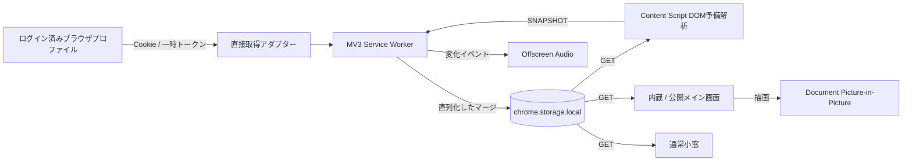

# LLMs トークン残量モニタ 詳細仕様書

文書版: 1.0  
対象製品版: 1.5.1
日本語名: **LLMs トークン残量モニタ**  
英語名: **LLMs Token Usage Monitor**  
対象リポジトリ: `ai-usage-panel`  
公開Webアプリ: `https://ai-usage-glance.ntusnog.chatgpt.site/`

## 1. 文書の目的

本書は、ChatGPT、Claude、Geminiのログイン中アカウントから利用枠を取得し、残り使用量、リセット時刻、契約プラン、関連クレジット、変化履歴を一画面に表示する製品の再実装仕様である。既存コードを参照できない実装者でも、同等の機能、制約、プライバシー特性、配布形態を再現できる粒度を定める。

本書では次の用語を使う。

- **MUST / 必須**: 受入条件を満たすために実装しなければならない。
- **SHOULD / 推奨**: 明確な理由がない限り実装する。
- **MAY / 任意**: 製品要件を損なわない追加機能である。
- **サービス**: ChatGPT、Claude、Geminiのいずれか。
- **スナップショット**: 1回の取得で得た、あるサービスの正規化済み状態。
- **利用枠**: 5時間枠、現在のセッション、週間枠など、残率を0〜100%で表せる項目。
- **補足指標**: クレジット、利用上限リセット権など、利用枠以外の値。
- **メイン画面**: 拡張機能内蔵ページまたは公開Webアプリのダッシュボード。
- **サイト内パネル**: ChatGPT、Claude、Geminiの各公式ページへContent Scriptが挿入する小型表示。
- **通常小窓**: `chrome.windows.create({type: "popup"})` で開く拡張機能ウィンドウ。
- **最前面表示**: Document Picture-in-Pictureで開く、OS上で他ウィンドウより前面に置かれる小型表示。

## 2. 製品範囲

### 2.1 必須機能

製品は以下を提供しなければならない。

1. ログイン中のブラウザセッションを使い、3サービスの残り使用量を60秒ごとに取得する。
2. 各サービスの公式利用量ページを別タブで開いたままにせず、拡張機能のバックグラウンドから取得する。
3. 未ログイン時には、そのサービスの公式ログインまたは利用量ページを開く操作を提示する。製品自身にID・パスワード入力欄は設けない。
4. 各サービスについて、契約プラン、主利用枠、週間枠、リセット時刻、取得できた補足指標を同じカード内に表示する。
5. 更新中および一時的な取得失敗時に前回値を保持する。
6. 数値が変化した場合だけ履歴へ追加し、変化した数字だけを10秒間赤く点滅させる。
7. 1つの変化イベントにつき、通知音を1秒間隔で最大3回鳴らす。通知音設定の初期値はONとする。
8. 標準テーマとダークテーマ、背景不透明度、サイト内パネル位置、通知音量、表示ON/OFFを保存して全表示面へ同期する。
9. フルスクリーン時はページ全体のスクロールを発生させず、画面内に3サービスと操作部と下部アドバイスを収める。
10. ブラウザ起動時に通常小窓を1つ自動表示し、ユーザー操作により最前面表示へ切り替えられるようにする。
11. すべての使用量、履歴、設定をブラウザ端末内に保存し、運営サーバーへ送信しない。
12. Chrome Web StoreおよびMicrosoft Edge Add-onsへ提出可能なManifest V3パッケージを生成する。

### 2.2 対象外

以下は本製品の対象外である。

- ChatGPT、Claude、Geminiへのプロンプト送信。
- プランの購入、解約、変更。
- クレジット購入、利用上限リセット権の自動行使。
- 複数アカウントまたは複数組織の利用枠の合算。
- 公式サービスが公開していない残量の推定値を、実測値として表示すること。
- OSネイティブの常駐アプリ、メニューバーアプリ、タスクトレイアプリ。
- Safari、Firefox、モバイルブラウザの正式サポート。

## 3. 対応環境

### 3.1 正式対象

- Google Chrome デスクトップ最新版および直前の主要版。
- Microsoft Edge デスクトップ最新版および直前の主要版。
- macOS、Windows、Linux。機能はブラウザ拡張APIの範囲で共通とする。
- JavaScript、CSS Grid、Web Audio、Chrome Extension Manifest V3を利用できる環境。

### 3.2 表示面

| 表示面 | データ取得 | 自動起動 | 最前面 | 背景不透明度 | 主用途 |
|---|---:|---:|---:|---:|---|
| 拡張機能内蔵メイン画面 | 拡張機能へ内部メッセージ | なし | なし | プレビューへ反映 | 全情報・設定 |
| 公開Webアプリ | 拡張機能へ外部メッセージ | なし | なし | プレビューへ反映 | 配布・接続・全情報 |
| 公式サイト内パネル | 拡張機能へ内部メッセージ | 対象ページ表示時 | ページ内のみ | 対応 | 作業中の確認 |
| 通常小窓 | 拡張機能へ内部メッセージ | ブラウザ起動時 | 非対応 | パネル面へ対応 | 自動表示 |
| Document PiP | 親メイン画面の状態を描画 | ユーザー操作後のみ | 対応 | パネル面へ対応 | OS横断の最前面表示 |

## 4. リポジトリ構成と責務

再実装時は、少なくとも次の責務分離を維持する。

```text
ai-usage-panel/
├── dist/                    公開Webアプリの配布元
│   ├── index.html           メイン画面
│   ├── app.js               UI、RPC、PiP、全画面、設定
│   ├── shared.js            共通表示・整形・履歴表示
│   ├── changes.js           数字単位の変化追跡
│   ├── sound.js             Web画面の通知音
│   ├── advice.js            履歴ベースのアドバイス
│   └── style*.css           基本および版別スタイル
├── extension/
│   ├── manifest.json        Manifest V3定義と製品バージョン
│   ├── background.js        取得、スケジュール、状態、メッセージ
│   ├── notification-batch.js 更新単位の通知集約
│   ├── fetchers.js          各サービスの直接取得アダプター
│   ├── parser.js            公式ページDOMの予備解析
│   ├── state.js             スナップショットのマージ
│   ├── history.js           変化履歴の保存
│   ├── content.js           Shadow DOMサイト内パネル
│   ├── floating.*           通常小窓
│   ├── offscreen.*          バックグラウンド通知音
│   └── _locales/            日本語・英語ストア名
├── tests/                   Node標準テスト
├── build.py                 共通ファイル同期とZIP生成
├── README.md                利用説明
├── PRIVACY.md               プライバシーポリシー
└── STORE_SUBMISSION.md      ストア提出手順
```

`dist/` を共通UIの正本とし、ビルド時に共通ファイルを `extension/` へ複製する。取得アダプター、Content Script、Service Worker、Offscreen Documentは拡張機能専用とする。製品バージョンの正本は `extension/manifest.json` とし、ファイル名およびUIのバージョン表示をビルド時に検証する。

## 5. システムアーキテクチャ



### 5.1 取得優先順位

1. Service Workerから公式ページ/APIを直接取得する方式を第一選択とする。
2. 直接取得で得られない項目は、公式ページをユーザーが開いている場合に限りContent ScriptのDOM解析を補助入力として受け付ける。
3. DOM入力は直接取得済み項目を不必要に削除してはならない。DOMスナップショットにない既存項目は、同一アカウントで有効な間は保持する。
4. 公式ページのタブを自動的に常駐させてはならない。

### 5.2 更新スケジュール

- インストール時およびブラウザ起動時に初回更新を開始する。
- `chrome.alarms` で1分周期のアラームを作成する。
- 手動の「今すぐ更新」も同じ更新処理を呼ぶ。
- 同時更新要求はキューへ直列化し、同じ状態への競合書き込みを防ぐ。
- 3サービスの通信は並列実行してよいが、各サービスの状態マージと履歴書き込みは直列化する。
- 各サービスの1回の取得は25秒程度でタイムアウトさせ、他サービスを巻き添えにしない。
- UIは2秒以下の間隔で保存状態を再取得するか、同等のイベント駆動同期を行う。

「リアルタイム」は、公式サービスの反映遅延とブラウザアラームの制約を含む、おおむね60秒間隔の監視を意味する。連続ストリーミングを意味しない。

## 6. 公式サービスからの取得

### 6.1 共通規則

- 通信先はManifestの `host_permissions` に列挙した公式ドメインに限定する。
- すべてのログイン依存リクエストに `credentials: "include"` と `cache: "no-store"` を指定する。
- HTTP 401/403、ログインリダイレクト、必須セッション値の欠落は `login` 状態に正規化する。
- 構造変更、一時障害、パース不能は `unavailable` とし、前回値を保持する。
- 得られない値は `未取得` または `—` と表示し、推測で補完しない。
- 0〜100%の値は範囲外をクランプし、`NaN`、無限大、非数値を受け付けない。
- 公式サービスの時刻はミリ秒のUnix時刻へ正規化し、表示時だけ端末ローカル時刻へ変換する。

### 6.2 ChatGPT

#### 6.2.1 取得元

1. `GET https://chatgpt.com/settings/usage?tab=overview`
2. HTML内の `script#client-bootstrap` を解析し、現在セッションの `accessToken`、`accountId`、`planType` を取り出す。
3. `GET https://chatgpt.com/backend-api/wham/usage?supports_rewardless_invites=true`
4. ヘッダーに `Authorization: Bearer <accessToken>` を指定する。
5. `accountId` がある場合は `ChatGPT-Account-Id` を指定する。
6. 取得完了または失敗のどちらでも、`finally` でトークンとアカウントIDへの参照を空にする。

#### 6.2.2 正規化項目

- `primary_window`: 原則として `Work / Codex · 5時間`。
- `secondary_window`: 原則として `週間 (Work / Codex)`。
- `used_percent` から `remaining = 100 - used_percent` を計算する。
- `reset_at` または `reset_after_seconds` を `resetAt` に変換する。
- `planType` およびレスポンス中の契約情報から Plus、Pro、Team、Business、Enterprise、Freeなどを正規化する。
- `credits`: 残高または無制限状態を補足指標にする。
- 利用上限リセット権がレスポンスにある場合、利用可能件数、種別、期限を `利用上限のリセット` として表示する。
- リセット権の期限が1週間以内なら警告表示する。

#### 6.2.3 明示する制約

この取得元が通常Chatの正確な残量を返さない場合、カードには **「通常のChat：取得不可（上記とは別枠）」** と明記する。Work / Codex枠を通常Chat残量として表示してはならない。

### 6.3 Claude

#### 6.3.1 取得元

1. `GET https://claude.ai/api/organizations`
2. 組織は `is_active`、前回保存した組織ID、先頭組織の順に選択する。
3. `GET https://claude.ai/api/organizations/{organizationId}/usage`
4. `GET https://claude.ai/api/organizations/{organizationId}/prepaid/credits`
5. 選択した組織IDは `claudeOrganizationId` として端末内だけに保存する。

#### 6.3.2 正規化項目

| Claudeフィールド | 表示名 |
|---|---|
| `five_hour` | 現在のセッション |
| `seven_day` | 週間 |
| `seven_day_sonnet` | Sonnet・週間 |
| `seven_day_opus` | Opus・週間 |
| `seven_day_oauth_apps` | OAuthアプリ・週間 |
| `seven_day_cowork` | Cowork・週間 |

`utilization` が0〜1なら `remaining = 100 - utilization * 100`、0〜100なら `remaining = 100 - utilization` とする。未使用セッションでリセット時刻がない場合は「最初のメッセージから開始します」と表示してよい。

補足指標には、レスポンスに存在するものだけを次の名称で含める。

- クラウドセッションクレジット: 残額、総額、残率、期限。
- 使用クレジット: 残高、通貨、期限。
- 追加使用クレジット: 残量、総額、残率、期限。
- プロジェクトセットアップクレジット: 残量。

契約プランは組織オブジェクト配下の `plan`、`tier`、`subscription`、`billing`、`entitlement`、`product` に相当するフィールドを深さ制限付きで探索する。

### 6.4 Gemini

#### 6.4.1 取得元

1. 次のプレフィックスを順に試す: 空文字、`/u/0`、`/u/1`、`/u/2`、`/u/3`、`/u/4`。
2. `GET https://gemini.google.com{prefix}/usage?pageId=none&t={timestamp}`
3. HTMLから内部値 `cfb2h`、`FdrFJe`、`SNlM0e`、`GGcqce` を抽出する。
4. RPC ID `jSf9Qc` を指定して `/_/BardChatUi/data/batchexecute` へPOSTする。
5. RPCレスポンスの利用率とリセット時刻を現在セッションと週間枠へ変換する。
6. 契約名が得られない場合はアカウント状態RPC `otAQ7b`、Geminiの `/subscriptions`、`/settings`、`/settings/subscription` の順に確認する。
7. さらに未取得の場合は、同じアカウント番号の `https://one.google.com{prefix}/settings`、`/storage`、`/benefits` から現在契約中のGoogle AIメンバーシップ名を読む。
8. Geminiの使用量取得元とGoogle Oneの契約取得元は同じ `{prefix}` を使い、異なるGoogleアカウントの情報を混在させない。

#### 6.4.2 正規化項目

- 利用率が0〜1なら `remaining = (1 - utilization) * 100`、0〜100なら `remaining = 100 - utilization`。
- RPCの区分値から `現在のセッション` と `週間` を判定する。
- 契約名は Google AI Ultra、Google AI Pro、Google AI Plus、無料プランなどへ正規化する。
- 旧名称 `Google One AI Premium` と `Gemini Advanced` は `Google AI Pro` 相当として正規化する。
- 契約名を補足指標 `Google AI 契約プラン` として重複表示してよいが、カード見出し直下の契約名を正本とする。

## 7. 正規化データモデル

JavaScriptの論理型として次を満たす。保存前に外部入力を検証・短縮する。

```ts
type ServiceId = "chatgpt" | "claude" | "gemini";
type Status = "ready" | "loading" | "login" | "unavailable" | "error";

interface PreviousNumber {
  remaining: number;
  capturedAt: number;
}

interface UsageWindow {
  label: string;             // 最大80文字
  remaining: number;         // 0..100
  reset: string;             // 最大150文字
  resetAt: number | null;    // Unix ms
  previous?: PreviousNumber;
  _source?: "api" | "dom"; // 内部マージ用
}

interface PreviousValue {
  value: string;
  capturedAt: number;
}

interface ExtraMetric {
  label: string;             // 最大80文字
  value: string;             // 最大160文字
  detail: string;            // 最大180文字
  expiresAt?: number | null;
  observedAt?: number | null;
  barPercent?: number | null; // 0..100
  previous?: PreviousValue;
  _source?: "api" | "dom"; // 内部マージ用
}

interface HistoryEntry {
  capturedAt: number;
  remaining: number;
}

interface ServiceSnapshot {
  status: Status;
  plan: string;
  windows: UsageWindow[];
  extras: ExtraMetric[];
  capturedAt: number | null;
  refreshing: boolean;
  refreshStartedAt?: number;
  note: string;
  source?: "api" | "dom";
  accountKey?: string;       // 保存する場合は不可逆識別子
  history?: Record<string, HistoryEntry[]>; // 読み出し時に合成
}

interface Settings {
  opacity: number;           // 15..100、既定55
  position: "bottom-right" | "bottom-left" | "top-right" | "top-left";
  enabled: boolean;          // 既定true
  theme: "dark" | "standard"; // 既定dark
  sound: boolean;            // 既定true
  volume: number;            // 1..50、既定18
}
```

### 7.1 保存キー

`chrome.storage.local` に次を保存する。

| キー | 内容 |
|---|---|
| `data` | `Record<ServiceId, ServiceSnapshot>`。`history` は含めない |
| `history` | サービス・利用枠別の変化履歴 |
| `historyLast` | 次回比較用の直近残率。表示履歴とは分離 |
| `settings` | 共通表示・通知設定 |
| `claudeOrganizationId` | 最後に選択したClaude組織 |
| `floatingWindowId` | 現在の通常小窓ID。終了時に削除 |

保存済みアクセストークン、Cookie、パスワード、APIキーを表すキーを追加してはならない。

## 8. 状態遷移とマージ

### 8.1 更新開始

更新開始時は既存スナップショットを保持したまま次を設定する。

```js
{
  ...old,
  status: "loading",
  refreshing: true,
  refreshStartedAt: Date.now(),
  note: "更新中 · 前回取得値を表示しています。"
}
```

UIは値を消してはならない。取得中は前回値を維持したまま状態ラベルを「更新中」とし、`aria-busy="true"` を設定する。更新開始から45秒を超えたら「更新待ち（前回値）」と表示する。点滅は取得完了後に変化した数字だけへ適用し、カードや行全体を点滅させてはならない。

### 8.2 `ready` の受入

新スナップショットを受け入れる処理は以下の順で行う。

1. `accountKey` が双方にあり不一致なら、旧スナップショットをマージ元に使わない。
2. 利用枠は正規化ラベルで照合する。`Work / Codex · 週間` と `週間 (Work / Codex)` は同一枠として移行する。
3. 残率が変わった場合だけ、旧値と旧 `capturedAt` を `previous` に設定する。
4. 同値なら既存の `previous` を保持する。
5. 新しい `resetAt` が妥当なら採用する。欠落時は未来の旧 `resetAt` を保持し、期限切れなら `null` にする。
6. 補足指標はラベルで照合する。値が変わった場合だけ `previous` を更新する。
7. `未取得` が一時的に来ても、同一アカウントの既知値がある場合は既知値を保持してよい。
8. ChatGPTの `利用上限のリセット` は、件数が同じで旧期限が未来なら、応答から期限だけ欠けた場合に旧期限と詳細を保持する。
9. リセット権項目自体が一時的に欠けても、旧期限が未来なら保持する。
10. 新プランが空または `未取得` なら、同一アカウントの旧プランを保持する。
11. `capturedAt = now`、`refreshing = false` とする。

各利用枠・補足指標へ内部取得元 `_source` を付与する。API入力とDOM入力は同じラベルの新値を更新し、反対側の取得元にしか存在しないラベルを保持する。同じ取得元が次回応答で返さなかったラベルは削除対象とし、期限付き補足指標は期限切れ後に保持しない。これにより、API更新でDOMだけが取得できたリセット権を消したり、DOM更新でAPIだけが取得できた週間枠を消したりしない。

### 8.3 失敗状態

- `unavailable` または一般エラーでは、旧値を保持し、`status = "error"`、`refreshing = false`、注記を「取得できませんでした · 前回取得値を表示しています。」とする。
- 旧値がない場合は数値を `—` とする。
- 取得から125秒以上経過した値は「更新待ち」と表示するが、値自体は消さない。

### 8.4 ログイン状態

- ログインが必要な場合、現在表示中の利用枠と補足指標は空にし、`capturedAt = null`、`refreshing = false` とする。
- UIに「公式サイトでログイン」を表示し、対象サービスの公式ページだけを開く。
- 既存履歴はユーザーが明示的に削除しない限り端末内に保持してよいが、次回ログイン時の比較基準 `historyLast` はリセットする。
- 異なるアカウントの履歴を混ぜてはならない。再実装では、公式APIから得られるアカウントIDを不可逆ハッシュ化した `accountKey` で履歴を名前空間分離することを推奨する。識別子を安全に得られない実装では、ログアウトまたはアカウント切替検知時に比較基準を消し、旧履歴を新アカウントのアドバイス計算へ投入しない。

## 9. 変化履歴

### 9.1 記録規則

- 履歴の対象は `UsageWindow.remaining` だけとする。補足指標の前回値はスナップショット内に保持するが、履歴ログには必須としない。
- 取得成功時、利用枠ラベルごとに `historyLast` と比較する。
- 比較基準がない起動後または再ログイン後の最初の成功値は、基準値として履歴へ1件追加し、`historyLast` にも保存する。以後は値が変化した場合だけ追加する。
- 比較基準と残率が同じなら何も追加しない。
- 異なる場合は `{ capturedAt, remaining }` を末尾へ1件追加し、比較基準を更新する。
- 同一時刻・同一値および連続する同一残率は重複排除する。
- 旧ラベル `Work / Codex · 週間` の履歴は `週間 (Work / Codex)` へ移行・統合する。
- 保存上限は利用枠ごとに10,000件とする。10,000件を超えたときは最古から削除する。更新前の既存履歴は削除せず、そのまま新しい上限へ引き継ぐ。
- 起動時は全利用枠を横断して新しい順に最大10,000件を抽出し、表示とアドバイス分析へ同じ集合を渡す。履歴読込処理は2.6秒で打ち切り、画面描画と分析を含む起動処理が3秒以内に収まるようにする。
- 旧版が上限超過分をすでに削除していた場合、削除済み行を復元できると表示または仕様で主張してはならない。
- 書き込みは `history` と `historyLast` を同じ直列化キュー内で更新し、競合による重複や巻き戻りを防ぐ。

### 9.2 表示規則

- 各サービスカードの最下部、カード操作行より上に、利用枠ごとのスクロール可能なテキストボックスを置く。
- 新しい履歴を上に表示する。
- 1行は端末ローカル時刻で厳密に次の形式とする。

```text
YYYY-MM-DD HH:MM:SS　残り使用量 NN%
```

- 桁揃えのため、月、日、時、分、秒は2桁とする。
- 履歴がない場合は「数値が変化すると記録されます」と表示する。
- 枠ごとの件数を小さく表示する。
- テキストボックス内はスクロール可能とする。通常画面でカード全体を不必要に伸ばさない。
- 多数行は個別DOM要素へ展開せず、readonly textareaの単一テキスト値として描画し、10,000件でも描画負荷を抑える。
- フルスクリーンでも履歴欄を省略してはならない。画面高が小さい場合は履歴欄を縮め、内部スクロールで参照できるようにする。
- 起動時に `YYYY-MM-DDからYYYY-MM-DDまでN件の過去変化履歴を取得しました（読込・分析 Nms）` を表示する。3秒上限で一部だけを使った場合は保存総数、読込件数、上限適用を併記する。

## 10. 数値変化の視覚通知

### 10.1 判定単位

- 利用枠は表示文字列ではなく、サービスID、`window:<label>`、数字の出現位置で追跡する。
- 補足指標はサービスID、`extra:<label>`、数字の出現位置で追跡する。
- 初回観測、ログイン直後、更新中の値は変化扱いにしない。
- 前回観測に存在する数字と現在の同じ位置の数字が異なる場合だけ、その数字を変化扱いにする。
- 変化した行全体、カード全体、単位記号を赤くしてはならない。

### 10.2 アニメーション

- 変化した数字を10秒間、赤色で1秒周期に点滅させる。
- 複数の数字が同時に変化した場合は同じイベント改訂番号に属し、点滅位相を合わせる。
- 新しい変化が起きた数字だけ、その時点から10秒へ延長する。
- タブが休止していた時間の点滅や音を、復帰後にまとめて再生してはならない。
- `prefers-reduced-motion: reduce` では点滅を停止し、10秒間の赤色強調だけにする。

### 10.3 更新中表示との区別

更新中は前回値を保持し、状態ラベルと `aria-busy` で取得処理中を示す。カードまたは行全体を点滅させない。赤い点滅は取得完了後に変化した数字だけへ適用する。

## 11. 通知音

### 11.1 動作

- 設定初期値はON、音量初期値は18%、設定範囲は1〜50%とする。
- 1つ以上の数値変化を検出したイベントにつき、通知音を1秒間隔で最大3回鳴らす。
- 同時に複数項目が変化しても、項目数に比例して音を増やさない。
- 10秒間の視覚点滅のうち、音は最初の3回だけとする。
- 推奨音は880Hz付近、約0.12秒の短い正弦波で、立ち上がりと減衰を付ける。
- 音量変更は直ちに次の音へ反映する。
- 「試聴」操作を設ける。

### 11.2 ブラウザ制約への対応

通常WebページのWeb Audioは自動再生制限を受ける。メイン画面では、通知音設定がONでも、最初のポインターまたはキーボード操作で `AudioContext.resume()` を行う。操作前は「通知音 ON・操作待ち」と表示する。

拡張機能のバックグラウンド変化通知は、`offscreen` 権限と `AUDIO_PLAYBACK` 理由のOffscreen Documentを使用する。Service Workerは変化を180ms程度まとめ、設定がONなら `PLAY_CHANGE_SOUND` を1回送る。Offscreen Documentが3音のスケジュールを担当し、重複イベントを統合する。音声ファイルや波形生成コードはパッケージ内に置き、リモートコードを使わない。

## 12. メイン画面UI

### 12.1 ブランドと共通表示

- 画面内の主タイトルは1か所だけに **「LLMs トークン残量モニタ」** と表示する。
- 英語副題は **「LLMs TOKEN USAGE MONITOR」** とする。
- 旧名称 `glance` をユーザー向けタイトル、ファイル名、ストア名に使わない。
- 最下段に次を小さく表示する。

```text
Copyright (C) 2026 NT MicroSystems,Inc.
```

- 製品バージョンを併記する。
- ヘッダー、カード、操作部、履歴、フッターで十分な文字コントラストを確保する。

### 12.2 操作部

上部操作部には少なくとも以下を置く。

- 標準／ダークテーマ切替。
- フルスクリーン開始／終了。
- アドバイスON/OFF。
- 通知音ON/OFF、試聴、音量。
- 今すぐ更新。

接続済み表示は1行へ圧縮し、「ブラウザに接続済み」「60秒ごとに公式セッションを自動更新」「LOCAL」を表示する。未接続時は接続方法へ誘導し、ログイン情報は公式画面で入力する旨を明記する。

### 12.3 サービスカード

デスクトップ通常画面は3列とし、各カードに次の順で表示する。

1. サービスアイコン、サービス名、契約プラン、取得状態。
2. 主利用枠の大型円形ゲージ。
3. 円内の大型残率、`%`、`残り使用量`、リセット日時、残り時間。
4. 主利用枠名と横棒グラフ。
5. 週間枠名、残率、横棒グラフ、リセット時刻。
6. サービス固有注記。
7. `補足情報`。各サービスのカード内に配置する。
8. 変化履歴。
9. 取得経過時間と、ログインまたは公式利用量ページを開くボタン。

円形ゲージは通常画面で最大約264px、残率の数字は `clamp(76px, 7vw, 92px)` 相当とし、離れた位置から読めること。フルスクリーンでは画面高に応じ64〜92px程度へ調整する。主利用枠は円形ゲージだけでなく、精密に比較できる横棒も常時表示する。

残率15%以下は警告色とする。リセットまで2時間未満の場合は、リセット残時間を赤くし警告記号を添える。期限7日以内の補足指標も警告色にする。

### 12.4 状態表示

| 条件 | 表示 |
|---|---|
| スナップショットなし | 未接続 |
| `login` | ログインが必要 |
| 更新開始から45秒未満 | 更新中 |
| 更新開始から45秒以上 | 更新待ち（前回値） |
| 取得エラー、旧値あり | 更新待ち（前回値） |
| 最終取得から125秒以上 | 更新待ち |
| 取得成功、利用枠あり | 取得済み |
| 取得成功、数値なし | 数値未取得 |

### 12.5 テーマ

- ダークテーマと標準テーマを用意する。
- 標準テーマは白〜薄い灰色の面と濃色文字、ダークテーマは濃紺〜黒の面と明色文字を使う。
- テーマは `settings.theme` に保存し、メイン画面、プレビュー、サイト内パネル、通常小窓、PiPへ同期する。
- OSテーマの自動追従は任意だが、ユーザーの明示選択を優先する。
- テーマ変更でレイアウト寸法や情報量を変えない。

### 12.6 透明度

- UIラベルは「背景の不透明度」とし、15〜100%で変更できる。
- 値は `settings.opacity` に保存し、CSS変数 `--alpha = opacity / 100` として利用する。
- 背景面に `rgb(... / var(--alpha))` を適用する。文字、アイコン、グラフは同じ不透明度で薄くしてはならない。
- 子要素に不透明な背景を置く場合は、親の設定に比例する低いアルファ値へ変換する。
- 強い `backdrop-filter` は透明度を分かりにくくするため、ぼかしは2〜3px程度に抑える。
- 15%、55%、100%の3点で視覚差が明確でなければならない。
- 通常小窓とPiPのブラウザウィンドウ自体をOSデスクトップまで透過することはできない。この設定は小窓内のパネル面および背後の同一ウィンドウ内容に対する透明度である。

## 13. フルスクリーン

### 13.1 開始と終了

- `document.documentElement.requestFullscreen()` を使い、同じボタンで `document.exitFullscreen()` を実行する。
- `fullscreenchange` でボタン文言と `aria-pressed` を同期する。
- エラー時はトーストで通知し、通常レイアウトを壊さない。

### 13.2 レイアウト条件

- `html` と `body` をビューポート幅・高100%、`overflow: hidden` とする。
- ヘッダーは約48px、メイン領域は残り高とする。
- メイン領域は「上部操作」「3サービスカード」「下部アドバイス」のための高さを明示的に割り当てる。
- 1366×768以上の横長画面ではカードを3列で表示する。
- 高さが低い場合は注記や補足詳細を省略してよいが、主残率、週間残率、リセット、契約名、状態、変化履歴を維持する。履歴欄は高さを縮めて内部スクロールさせる。
- 狭い画面では、文字とゲージだけを極端に縮小するのではなく、カード内部を横向きのコンパクト配置へ変えてよい。
- ページ全体に縦横スクロールを発生させない。
- カード内部にどうしても収まらない任意情報は省略してよい。ただし主残率、週間残率、契約名、状態、変化履歴を隠してはならない。
- 下部アドバイスがカード、操作、ボタンに重ならないよう、メイン領域の下余白または専用グリッド行を確保する。
- セットアップ説明、配布案内、通常フッター、プレビュー、一般免責文はフルスクリーン中に隠してよい。

### 13.3 検証対象画面

少なくとも1920×1080、1366×768、1024×768、800×600で、本文の `scrollHeight <= clientHeight` を確認する。390×844ではモバイル相当の縮退レイアウトを確認し、重要情報の切れを許容しない。

## 14. サイト内パネル

- ChatGPT、Claude、Geminiの公式ドメインでContent Scriptを `document_idle` に実行する。
- ホストページのCSSと衝突しないよう、閉じたShadow Rootを使う。
- `position: fixed`、`z-index: 2147483646` 相当とする。
- 幅は約286px、最大幅は `100vw - 32px`、最大高は `100vh - 32px` とし、内部スクロールを許可する。
- 4隅の位置設定を16px程度の余白で反映する。
- 折りたたみボタンと、現在のサービスの公式利用量ページを開く操作を備える。
- サービス名、契約名、主残率、主バー、追加利用枠、補足情報、状態、取得時刻、著作権をコンパクトに表示する。
- 更新中は前回値を消さず、状態ラベルで更新中と示す。変化前の行全体は点滅させない。
- 表示OFFならホスト要素を非表示にする。
- ページから拡張機能へ送るDOMスナップショットは、そのページと一致するサービスIDだけを許可する。

## 15. 通常小窓と最前面表示

### 15.1 通常小窓

- ブラウザ起動および拡張機能インストール後に、設定 `enabled` がtrueなら `floating.html` を330×680px程度の `type: "popup"` で1つ開く。
- 保存済み `floatingWindowId` と実行中コンテキストを確認し、重複小窓を作らない。
- staleな小窓を除去してから新しい小窓を開く。
- ユーザーが閉じたときはIDを削除する。
- メイン画面の「通常小窓」で既存小窓をフォーカスし、なければ作成する。
- 小窓は主残量と補足情報をコンパクトに表示し、テーマと背景不透明度を同期する。

Chrome/Edgeの `chrome.windows.create` および `chrome.windows.update` は、作成した小窓をOS全体で常時最前面にする設定を提供しない。`Window.alwaysOnTop` は状態の読み取り用であり、作成パラメーターではない。したがって通常小窓を「最前面固定」と表示してはならない。

### 15.2 Document Picture-in-Picture

- メイン画面に「最前面に固定」ボタンを設ける。
- クリック時に `documentPictureInPicture.requestWindow({width: 340, height: 650})` 相当を実行する。
- PiP文書へローカルCSSだけを読み込み、テーマ、背景不透明度、最新データを反映する。
- 「最前面固定」と、親モニター画面を閉じると終了する旨をPiP内に表示する。
- PiPが開いたら通常小窓を閉じ、同内容の小窓が2つ残らないようにする。
- PiPが既にある場合は新規作成せずフォーカスする。
- 設定でフローティング表示をOFFにした場合はPiPも閉じる。
- ブラウザがDocument Picture-in-Pictureに非対応なら通常小窓へフォールバックし、その小窓は最前面ではない旨を通知する。

### 15.3 実現上の制約

Document Picture-in-Pictureには以下の制約がある。

1. 作成にはユーザージェスチャーが必要で、ブラウザ起動時に自動作成できない。
2. 開いた親ページを閉じるとPiPも終了する。
3. 画面上の座標を指定できない。
4. 同時に利用できるPiPは通常1つである。
5. 対応状況はChromiumの版と企業ポリシーに依存する。

このため、拡張機能だけで満たせる仕様は「起動時に通常小窓を自動表示し、ユーザーが一度操作するとOS横断の最前面PiPへ移行」である。起動直後から無操作でOS全体の常時最前面を求める場合は、Native Messagingを使うOS別コンパニオンアプリが必要となり、「シンプルでOS依存しないWebアプリ」という製品範囲外になる。

## 16. 利用アドバイス

### 16.1 表示

- 画面下端に横幅ほぼ一杯の1行ティッカーとして表示する。
- カードを覆わない専用領域を確保する。
- サービス、短い見出し、本文、根拠、ページ位置、次へボタンを表示する。
- 9秒ごとに次のアドバイスへ切り替える。マウスオーバー中は自動切替を停止してよい。
- ON/OFFと手動送りを提供する。
- 小画面では根拠とページ位置を省略し、見出しと本文を優先する。
- 標準／ダークテーマに対応する。

### 16.2 分析規則

- 分析には起動時に読み込んだ対象枠の有効な変化履歴を最大10,000件まで使う。
- サンプル3件未満または観測期間6時間未満ではプラン変更を勧めず、「利用傾向を学習中」と表示する。
- 消費量は隣接履歴間の残率低下だけを加算し、リセットによる増加を消費とみなさない。
- `burn = consumed / spanHours` とする。
- リセット時予測残率は `remaining - burn * hoursLeft` を0〜100にクランプする。
- 残率15%以下、またはリセットまで3時間超あるのに予測残率5%以下なら、上位プランを「比較候補」として提示してよい。
- 24時間以上観測し、現在65%以上で、リセットまで24時間以下または予測55%以上なら、下位プランを「比較候補」として提示してよい。
- 予測残率10〜40%なら現行プランを有効活用している旨を表示してよい。
- アドバイスは断定的な購入・解約指示にせず、比較や利用順序の提案とする。

### 16.3 ChatGPT利用上限リセット権

- 利用可能件数が1以上のときだけ助言対象にする。
- 主枠または週間枠の低い方が30%以下なら「行使候補」。
- 有効期限が7日以内なら期限優先の注意。
- 十分な残量がある場合は「温存」を案内する。
- 自動行使はせず、公式ページへのリンクだけを提供する。

## 17. メッセージングと入力検証

### 17.1 内部メッセージ

少なくとも次を実装する。

| type | 送信元 | 動作 |
|---|---|---|
| `GET` | 拡張機能ページ、Content Script | 設定と履歴合成済み状態を返す |
| `REFRESH` | 信頼済みメイン画面 | 全サービスを更新 |
| `OPEN` | 信頼済みメイン画面 | 指定サービスの公式ページを開く |
| `OPEN_CURRENT` | 公式サイト内パネル | 送信元と一致するサービスだけ開く |
| `FLOAT` | 信頼済みメイン画面 | 通常小窓を作成またはフォーカス |
| `CLOSE_FLOAT` | 信頼済みメイン画面 | 通常小窓を閉じる |
| `SETTINGS` | 信頼済みメイン画面 | 検証済み設定を保存 |
| `SNAPSHOT` | Content Script | 検証済みDOMスナップショットを受入 |
| `PLAY_CHANGE_SOUND` | Service Worker | Offscreen Documentで通知音 |

### 17.2 外部メッセージ

- 本番許可元は `https://ai-usage-glance.ntusnog.chatgpt.site` に限定する。
- 開発時にlocalhostを使う場合は、開発専用Manifestと明示的な許可元を使い、本番パッケージへ混入させない。
- `sender.url` から安全にoriginを取得し、完全一致で照合する。
- 外部から `SNAPSHOT` や任意URLを開く操作を許可しない。
- 拡張機能IDは英小文字a〜pの32文字だけを受け付ける。

### 17.3 DOM入力の上限

- 利用枠は最大6件、補足指標は最大8件。
- ラベル80文字、値160文字、詳細180文字、リセット説明150文字を上限とする。
- 残率、バー残率、時刻は有限数か検証する。
- UIへ挿入するテキストは必ずHTMLエスケープする。
- `innerHTML` を使う場合も、テンプレートに挿入する外部値をすべてエスケープする。

## 18. プライバシーとセキュリティ

### 18.1 データ最小化

- パスワードを読み取らない、入力させない、保存しない。
- CookieをJavaScriptから抽出・保存しない。
- ChatGPTアクセストークンは取得処理中のメモリ内だけで使用し、ストレージ、ログ、例外文、UIへ出さない。
- アカウント識別子を履歴分離に使う場合は不可逆ハッシュまたはサービス側の非メール識別子とし、メールアドレスを履歴キーに保存しない。
- 使用量、履歴、設定、Claude組織IDは `chrome.storage.local` だけに保存する。
- 公開Webアプリ自身のサーバーへ利用量をPOSTしない。
- 分析、広告、追跡、プロファイリング用SDKを組み込まない。

### 18.2 通信制限

- 拡張機能のネットワーク通信先はChatGPT、Claude、Gemini、Google Oneの公式ドメインと、ユーザーが開く公開Webアプリに限定する。
- 取得した値を第三者へ転送しない。
- 外部メッセージの許可元を最小化する。
- CSPは少なくとも `script-src 'self'; object-src 'none'` とし、リモートJavaScript、`eval`、インライン実行コードを使わない。

### 18.3 権限

必須権限は以下を基本とする。

- `storage`: 状態、履歴、設定。
- `alarms`: 60秒更新。
- `offscreen`: バックグラウンド通知音を実装する場合。
- ChatGPT、Claude、Gemini、Google Oneの公式ドメインに対する `host_permissions`: ログイン中セッションでの取得。

`tabs` や広域の `<all_urls>` を、必要性なしに追加してはならない。Side Panelを追加する場合だけ `sidePanel` を検討する。

### 18.4 データ削除

アンインストールまたは拡張機能ストレージの消去により、保存データを削除できることをプライバシーポリシーに記載する。任意で「履歴を消去」操作を提供してよい。

## 19. アクセシビリティ

- すべてのボタンはキーボード操作可能とする。
- フォーカス表示を消さない。
- トグルへ `aria-pressed` または `role="switch"` と状態を設定する。
- 更新対象カードへ適切な `aria-busy` を設定する。
- ゲージにはサービス名、枠名、残率を含む `aria-label` を付け、SVG装飾は読み上げ対象外にする。
- トーストは `role="status"`、`aria-live="polite"` とする。
- 色だけで低残量や期限を伝えず、警告記号または文言を併用する。
- 数字は等幅数字を使い、変化時のレイアウトシフトを防ぐ。
- `prefers-reduced-motion` を尊重する。

## 20. 配布・ビルド・デプロイ

### 20.1 ファイル名とバージョン

- ストア提出ZIPの形式は `LLMs-Token-Usage-Monitor-v{semver}.zip` とする。
- 旧名称をZIP、拡張機能名、HTMLタイトルに使わない。
- 対象版では `LLMs-Token-Usage-Monitor-v1.5.1.zip` とする。
- Manifest、UI定数、HTMLフッター、ダウンロードリンク、版別CSS、ZIP名のバージョンを一致させる。
- バージョンはSemantic Versioningを使う。

### 20.2 ビルド手順

1. `extension/manifest.json` のバージョンを更新する。
2. 版別CSSを `style-v{数字のみ}.css` として作成し、HTMLから読み込む。
3. `python3 build.py` を実行する。
4. ビルドは `dist/` の共通HTML/CSS/JSとルートのREADME/プライバシーポリシーを `extension/` へ同期する。
5. 旧版ZIPを削除し、`dist/LLMs-Token-Usage-Monitor-v{version}.zip` を生成する。
6. `node --test tests/*.test.cjs` を実行する。
7. ZIPを展開せず一覧検査し、Manifest、ロケール、アイコン、コード、文書だけが含まれ、`.git`、テスト、秘密情報、旧版CSSがないことを確認する。
8. `git status` と差分を確認し、意図しない生成物を含めない。

ビルドは再現可能で、同一入力から機能的に同一のパッケージを生成しなければならない。

### 20.3 ストア配布

- デベロッパーモードを不要にするには、Chrome Web StoreとMicrosoft Edge Add-onsで審査・公開しなければならない。
- ZIPをWebサイトから配布するだけでは、Chrome/Edgeの一般ユーザーがデベロッパーモードなしで恒常利用できる拡張機能にはならない。
- ストア提出物には、日本語・英語の名称と説明、アイコン、スクリーンショット、テスト手順、公開プライバシーポリシーURL、ホスト権限の用途説明を含める。
- ChatGPTトークンを一時利用する理由と、保存・共有しないことを審査説明へ明記する。
- 審査公開後、Webアプリのダウンロード案内を正式ストアURLへ置き換える。
- ストアIDが確定したら、公開Webアプリ側の接続導線と `externally_connectable` の整合を確認する。

### 20.4 Webアプリのデプロイ

- `dist/` を静的サイトとしてデプロイする。
- 本番URLは `https://ai-usage-glance.ntusnog.chatgpt.site/` とする。
- Webサーバーは使用量を受信するAPIを持たない。
- 本番デプロイ前に、拡張機能の許可origin、HTML内ZIPリンク、バージョン、プライバシーページを確認する。
- 公開範囲を変更するときは、ホスティング設定とプライバシー文書を同じリリースで更新する。

## 21. テスト仕様

### 21.1 自動テスト

最低限、次をテストする。

1. ChatGPT bootstrap、使用量、プラン、リセット権、期限の解析。
2. Claude組織、利用枠、クラウドセッションクレジット、使用クレジット、追加クレジットの解析。
3. Gemini RPC、現在枠、週間枠、複数アカウントプレフィックス、契約名の解析。
4. 更新開始が前回値を保持すること。
5. 同値で `previous` が更新されず、変化時だけ更新されること。
6. 失敗時に旧値とプランを保持すること。
7. `resetAt` とリセット権期限の保持・失効。
8. 履歴が起動後または再ログイン後の初回値を1件表示し、以後は変化時だけ追加され、同値を無視し、上限を守ること。
9. 旧週間ラベルから新ラベルへの履歴移行。
10. 数字単位の変化検出、10秒期限、初回非通知。
11. 1イベント3音、1秒間隔、ミュート、音量クランプ。
12. アドバイスの学習中、上位比較、下位比較、有効活用、リセット権条件。

### 21.2 手動ブラウザテスト

- ChromeとEdgeの新規プロファイルでストア相当パッケージを検証する。
- 3サービスすべてログイン済み、1サービスだけ未ログイン、全未ログインを検証する。
- 対象サービスのタブを閉じた状態でバックグラウンド取得できることを確認する。
- 60秒更新、手動更新、ブラウザ再起動、ネットワーク切断、401、タイムアウトを確認する。
- ブラウザ再起動直後に保存済み値が表示され、その後更新されることを確認する。
- 通常小窓が1つだけ自動起動することを確認する。
- PiPがクリックで開き、通常小窓が閉じ、親ページを閉じるとPiPが終わることを確認する。
- 透明度15%、55%、100%をダーク／標準テーマの全小型表示で比較する。
- 数値変化を模擬し、変化した数字だけが10秒点滅し、音が3回だけ鳴ることを確認する。
- 履歴の日時形式、順序、スクロール、同値非追加を確認する。
- フルスクリーンの各対象解像度でページスクロールと要素重なりがないことを確認する。
- DevToolsのNetworkとApplicationを使い、運営サーバーへの使用量送信やトークン保存がないことを確認する。

## 22. 受入基準

次をすべて満たした版を受入可能とする。

### 22.1 取得と状態

- [ ] ログイン済みの各サービスで、公式タブを常駐させずに残率を取得できる。
- [ ] 未ログイン時に製品内でパスワードを求めず、公式ログインへ誘導する。
- [ ] ChatGPTのPlus／Pro等、ClaudeとGeminiの取得可能な契約名を表示する。
- [ ] Claudeの取得可能なクレジット類をClaudeカード内に表示する。
- [ ] ChatGPTとGeminiの補足情報も、それぞれのカード内に表示する。
- [ ] 更新中と一時失敗で前回値が消えない。
- [ ] 60秒自動更新と手動更新が競合しない。

### 22.2 履歴と通知

- [ ] 起動後または再ログイン後の初回成功値が変化履歴へ1件表示される。
- [ ] 同値の再取得は履歴、`previous`、赤点滅を増やさない。
- [ ] 変化時だけ指定形式の履歴が追加され、上限を守る。
- [ ] 変化した数字だけが10秒間、1秒周期で赤く点滅する。
- [ ] 音はイベントの最初の3回だけ、1秒間隔で鳴る。
- [ ] 通知音は初期ONで、操作待ち、ミュート、音量、試聴が分かる。

### 22.3 UI

- [ ] タイトルが1つで、指定した日本語名・英語名・著作権を表示する。
- [ ] 円内の残率が離れた位置から読める大きさである。
- [ ] 主残率を円と横棒の両方で確認できる。
- [ ] 3カードの縦方向が過度に長くなく、情報密度が高い。
- [ ] 標準／ダークテーマがすべての表示面で同期する。
- [ ] 背景不透明度15%、55%、100%の違いが明確で、文字は読みやすい。
- [ ] フルスクリーンでページスクロールとアドバイスの重なりがない。
- [ ] 起動時に通常小窓が1つ表示される。
- [ ] 対応ブラウザでユーザー操作後に最前面PiPを表示できる。

### 22.4 配布とプライバシー

- [ ] ZIP、Manifest、UI、文書の名称とバージョンが一致する。
- [ ] 自動テストがすべて成功する。
- [ ] ストア審査に必要なロケール、アイコン、説明、プライバシー文書がある。
- [ ] パスワード、Cookie、アクセストークンを保存・記録・第三者送信しない。
- [ ] 保存データがブラウザローカルに限定される。
- [ ] 外部メッセージが本番許可origin以外から拒否される。

## 23. 変更手順

### 23.1 公式サービスの構造変更

1. 個人情報とトークンを除去した応答サンプルを作る。
2. 対応する `fetchers` または `parser` のfixtureテストを先に追加する。
3. 既存ラベル、保存履歴、旧版データとの互換性を確認する。
4. 取得できない値を推測で埋めず、`未取得` へ安全に縮退させる。
5. ホスト権限追加が必要なら、取得の必要性、ストア審査、プライバシー文書への影響を確認する。
6. 実アカウントでログイン、複数アカウント、未ログインを手動検証する。

### 23.2 データモデル変更

1. 新フィールドを原則optionalで追加する。
2. 保存済み旧スナップショットを読み込めるようにする。
3. 履歴ラベル変更時は別枠を作らず、alias移行を実装する。
4. `chrome.storage.local` の更新を直列化し、部分書き込みで他サービスを失わないようにする。
5. アカウント境界とプライバシー影響をレビューする。

### 23.3 UI変更

1. 通常、標準、ダーク、フルスクリーン、サイト内、通常小窓、PiPの各表示面を一覧化する。
2. 共通表示は `dist/` の正本を修正する。
3. 不透明度を背景だけに適用する。
4. 5つの対象ビューポートで重なり、スクロール、文字切れを確認する。
5. キーボード、読み上げ属性、reduced motionを確認する。
6. ビルドで `extension/` へ同期し、生成差分を確認する。

### 23.4 リリース

1. 変更内容に応じてSemVerを決める。
2. Manifestを更新する。
3. UI、リンク、文書、版別CSSのバージョンを同期する。
4. テスト、ビルド、ZIP検査を行う。
5. Webアプリをデプロイする。
6. Chrome Web StoreとEdge Add-onsへ同一機能のパッケージを提出する。
7. 公開後にストアURLをWebアプリへ反映する。

## 24. 既知の制約

1. 3サービスの取得APIとHTML構造は公開安定APIではなく、予告なく変更される可能性がある。
2. ChatGPTの公式使用量画面から通常Chat残量を取得できない場合がある。本製品は値を捏造しない。
3. プラン名、追加クレジット、期限は、公式応答に存在する場合だけ表示できる。
4. 公式側の反映が遅い場合、本製品の60秒更新より遅れて見える。
5. Manifest V3 Service Workerとアラームはブラウザ省電力制御により遅延することがある。
6. Web Audioはユーザー操作前に鳴らせないことがある。拡張機能ではOffscreen Documentで補う。
7. 通常小窓はOS全体の常時最前面ではなく、ウィンドウ全体のネイティブ透過にも対応しない。
8. Document PiPはユーザー操作、親ページ存続、単一ウィンドウ、位置指定不可という制約がある。
9. 起動時から無操作の常時最前面は、拡張機能だけでは実現できない。
10. ストア公開前のZIPは審査・テスト用であり、デベロッパーモード不要の一般配布物ではない。
11. 複数アカウントでは、現在公式サイトで選択中のアカウントだけを表示する。合算しない。
12. アカウントIDを安全に取得できないサービスでは、アカウント切替を完全自動判定できない場合がある。
13. Safari、Firefox、モバイルブラウザは未検証である。
14. 非常に小さい画面のフルスクリーンでは補足詳細を省略してよいが、変化履歴は高さを縮めて常時表示する。

## 25. 要件トレーサビリティ

| ID | ユーザー要件 | 本仕様の実現箇所 | 主な検証 | 制約・備考 |
|---|---|---|---|---|
| R-001 | ChatGPT/Claude/Geminiの残量を一画面表示 | 2、6、12 | 3サービス実アカウント | 公式取得可能値のみ |
| R-002 | OS依存しないWebアプリ | 3、5、20 | Chrome/Edge・3 OS | 拡張APIを利用 |
| R-003 | ログイン中アカウントを利用 | 6、18 | ログイン済み通信 | パスワード非取得 |
| R-004 | 未ログインなら入力を求める | 6.1、8.4 | 401/403 | 入力は公式画面で行う |
| R-005 | 1分ごとに更新 | 5.2 | アラームと手動更新 | 省電力で遅延あり |
| R-006 | 変更前値と日時 | 7、8.2、12.3 | 同値・変化テスト | `previous` へ保持 |
| R-007 | 更新中に値を消さず状態表示 | 8.1、10.3 | 45秒境界 | 行全体は点滅させない |
| R-008 | 各サービスの補足情報 | 6、12.3 | fixture・カード確認 | 公式値がある場合のみ |
| R-009 | 指定タイトルを1つだけ表示 | 12.1 | DOM確認 | 旧glance名を廃止 |
| R-010 | 指定著作権表記 | 12.1 | フッター・小窓確認 | 表記を完全一致 |
| R-011 | 変化した数字だけ10秒赤点滅 | 10 | 数字位置・期限テスト | 行全体は点滅しない |
| R-012 | 1秒ごとの通知音 | 11 | 音タイマーテスト | ブラウザ制限あり |
| R-013 | 音は最初の3回だけ | 11.1 | 10秒変化イベント | 同時変化を統合 |
| R-014 | 通知音を既定ON | 11 | 初期設定確認 | Webは初回操作待ち |
| R-015 | 小型パネルの半透明 | 12.6、14、15 | 15/55/100%比較 | OS窓自体は非透過 |
| R-016 | UIの縦方向を圧縮 | 12.2、12.3、16 | 1366×768確認 | 情報優先順位あり |
| R-017 | 契約プランを表示 | 6.2〜6.4、12.3 | Plus/Pro等fixture | 一時欠落時は既知値保持 |
| R-018 | フルスクリーン | 13 | 対象解像度確認 | ページ全体は無スクロール |
| R-019 | 標準／ダーク切替 | 12.5 | 全表示面同期 | ユーザー選択を保存 |
| R-020 | 前回値を履歴ボックス化 | 9.2 | 書式・順序確認 | 枠ごとに表示 |
| R-021 | 履歴は初回と変化時のみ | 9.1 | 初回・同値・変化 | 起動後初回を1件表示 |
| R-022 | 長期履歴を確認・分析 | 9、16.2 | 最大10,000件を3秒以内で読込・描画・分析 | 保存上限は利用枠ごとに10,000件 |
| R-023 | 大型の円内残率 | 12.3 | 視認性・CSS確認 | 76〜92px目安 |
| R-024 | 主残量の横棒 | 12.3 | 通常・全画面確認 | 円と併記 |
| R-025 | 拡張機能ファイル名を改名 | 20.1 | ZIP名確認 | 英語名を使用 |
| R-026 | 別タブなしで取得 | 5.1、6 | タブを閉じて更新 | 直接取得優先 |
| R-027 | デベロッパーモード不要 | 20.3 | ストア公開版導入 | ストア審査が必須 |
| R-028 | 起動時にフローティング表示 | 15.1 | ブラウザ再起動 | 通常小窓を自動表示 |
| R-029 | 常時最前面 | 15.2、15.3 | PiP手動検証 | 最初のクリックが必要 |
| R-030 | 下部の横長アドバイス | 16.1 | 重なり・9秒切替 | 小画面は情報を縮退 |
| R-031 | 履歴からプラン活用を助言 | 16.2 | advice単体テスト | 学習不足時は勧めない |
| R-032 | リセット権の期限・助言 | 6.2、16.3 | 件数・期限テスト | 自動行使しない |
| R-033 | 低残量・短時間の警告 | 12.3 | 15%、2時間境界 | 色と記号を併用 |
| R-034 | プライバシー保護 | 18 | Storage/Network監査 | トークンは一時メモリのみ |
| R-035 | クールで実用的なUI | 12〜16、19 | 視覚・操作レビュー | 情報密度と可読性を両立 |

## 26. 実装完了の定義

実装完了とは、コードが存在するだけでなく、次の状態を指す。

1. 本書の受入基準を満たす。
2. 自動テストが成功する。
3. 実アカウントでのChrome/Edge手動確認を終える。
4. 通常画面、フルスクリーン、サイト内パネル、通常小窓、PiPの表示を確認する。
5. プライバシー文書とストア権限説明が実装と一致する。
6. `LLMs-Token-Usage-Monitor-v1.5.1.zip` が再現可能に生成され、内容を検査済みである。
7. 公開Webアプリとストア提出パッケージの名称、バージョン、接続originが一致する。
